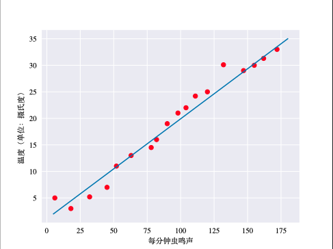
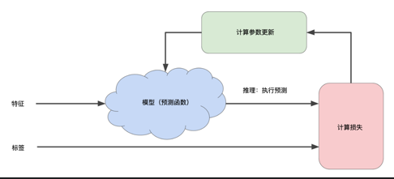
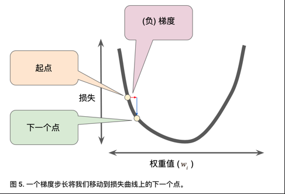

> 学习目标：
>
> - 复习直线拟合知识
> - 机器学习中的权重和偏差和直线拟合中的斜率和偏移联系起来
> - 大致了解损失(Loss)，详细了解平方损失(Squared Error)
> - 了解如何使用迭代方法来训练模型
> - 全面了解梯度下降法和一些变体如(小批量梯度下降，随机梯度下降)
> - 尝试不同的学习速率

## 深入了解机器学习(Descending into ML)

### 线性回归(Linear Regression)

鸣叫声和温度的关系可以描述如下：
$$y=mx+b$$

 - $y$指的是温度（以摄氏度表示），即我们试图预测的值。
 - $m$指的是直线的斜率.
 - $x$指的是每分钟的鸣叫声次数，即输入特征的值。
 - $b$指的是 y 轴截距

写作机器学习中常见的形式：
$$y'=b+w_1x_1$$
 - $y'$指的是预测标签。
 - $b$指的是偏差，也被称为$w_0$.
 - $w_1$是特征1的权重
 - $x_1$是指特征1

假如模型包含多个特征：
$$y'=b+w_1x_1+w_2x_2+w_3x_3$$

### 训练与损失(Training and Loss)
**平方损失**，又称L2损失
$$Loss2=(y-y')^2$$

**均方误差**指的是每个样本的平均平方损失。
$$MSE=\frac{1}{N}\sum_{(x,y)\in{D}}{(y-prediction(x))^2}$$

 - $(x,y)$指的是样本，$x$是特征集，$y$是相应的标签。
 - $prediction(x)$指的是集合了权重、特征、偏差的函数
 - $D$指的是包含多个有标签样本的数据集
 - $N$指的$D$中的样本数量

### 降低损失(Reducing Loss)
#### 如何降低损失？
**平方损失**相对于权重和偏差的导数可以展现损失的变化情况。

 - 易于计算且为凸形。
 - 在降低损失的方向上移动小步（负梯度方向），小步被称为**梯度步长**，这种优化策略称为**梯度下降法**。

#### 梯度下降示意 
迭代方法。

#### 权重初始化
对于凸形问题(碗的形状)，权重可以从任意位置开始，（如：全为0）
 - 只有一个最低点(minimum),可以达到全局最优
注意，不适用于神经网络
 - 非凸
 - 多个最低点
 - 很大程度依赖初始值

#### SGD和Batch-GD
 -可以每步都计算整个数据集的梯度，但事实不需要这样做。
 - 计算小型数据样本的梯度效果很好
  - 每一步抽取一个新的随机样本
 - 随机梯度下降法：一次抽取一个样本
 - 小批量梯度下降：每批次包含10-1000个样本
  - 损失和梯度在整批范围内达到平衡

 实践中往往采用折中的方法，Batch-SGD。

#### 学习速率
每个回归问题都存在一个Goldilocks的学习速率，如果梯度较小，可以用较大的学习速率来补偿较小的梯度获得更大的步长。
