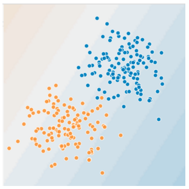
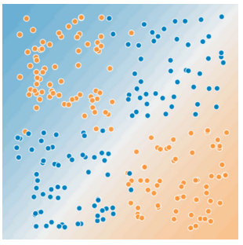

> 学习目标：
>
> - 了解什么是特征组合
> - 在TensorFlow中实践特征组合

## 特征组合(Feature Crosses)

### 对非线性规律进行编码



**图1. 这是线性问题，我们可以用一条线很好地做出预测**



**图2. 非线性问题，不能用一条线将两种类型的数据分开**

为了解决图2的非线性问题，可以创建一个特征组合。**特征组合**是指通过将两个或多个输入特征相乘来对特征空间中的非线性规律进行编码的合成特征。“cross”(组合)这一术语来自cross product(向量积)。比如，利用$x_1$和$x_2$两个特征组合得到：$$x_3=x_1x_2$$

线性公式变为：

$$y=b+w_1x_1+w_2x_2+w_3x_3$$

### 特征组合的种类

我们可以创建很多不同种类的特征组合：

- [A x B]
- [A x B x C x D x E]
- [A x A]

通过随机梯度下降法可以有效地训练线性模型，在使用扩展的线性模型时，辅以特征组合一直都是训练大规模数据集的有效方法。

### 组合独热矢量

前面我们已经知道如何组合两个单独的浮点数特征。实践中，机器学习模型很少会组合连续特征，但是常常**组合独热特征矢量**，将独热特征矢量的特征组合视为逻辑连接。

比如我们将用到的*加州房价数据集*中的经度和纬度信息进行分箱，分别获得5元素特征矢量。

```python
binned_latitude = [0, 0, 0, 1, 0]
binned_longitude = [0, 1, 0, 0, 0]
```

对两个特征矢量创建特征组合：

```python
binned_latitude x binned_longitude
```

我们将得到25个元素的独热矢量。

### 为什么要特征组合?

- 线性学习器可以很好地扩展到大量数据，但如果不使用特征组合，这些模型的表现会受到限制。
- 使用特征组合+大量数据是学习高度复杂模型的一种有效策略
  - （神经网络可提供另一种策略）

编程参见：[feature_crosses.ipynb](../code/feature_crosses.ipynb)

