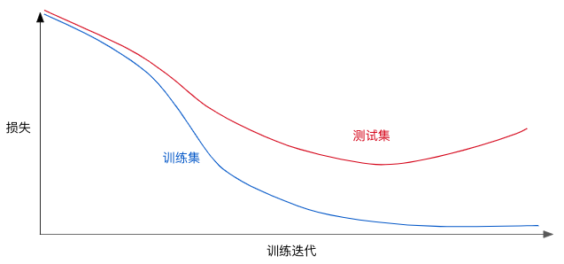

> 学习目标：
>
> - 了解模型复杂度和泛化之间的权衡
> - 使用L2正则化进行实验

# 第8节 简化正则化

## 8.1. L2正则化

如下**泛化曲线**，显示了训练集和验证集相对于迭代次数的损失。

**图1. 训练集和验证集损失**

该泛化曲线表明模型与训练集中的数据过拟合。根据奥卡姆剃刀原则，我们可以通过降低模型的复杂度来避免过拟合，这种原则叫正则化。

我们的模型并非只以最小化损失(**经验风险最小化**)为目标：

$$minimize(Loss(Data|Model))$$

而是以最小化损失和复杂度为共同目标，称**结构风险最小化**：

$$minimize(Loss(Data|Model) + complexity(Model))$$

现在，我们的训练优化算法是由两部分组成的函数：

- 损失项：衡量模型与数据的拟合度
- 正则化项：衡量模型的复杂度，与数据无关

这里我们介绍两种衡量模型复杂度的方式：

- 模型中**所有特征的权重**的函数（特征权重的绝对值越高，对模型复杂度的贡献越大）

- 具有**非零权重的特征总数**的函数

我们可以使用$L_2$正则化公式来量化复杂度，该公式正则化项定义为所有特征权重的平方和：

$$L_2\ regularization\ term = ||w||_2^2=w_1^2+w_2^2+\dots+w_n^2$$

在这个公式中，接近于0的权重对模型的复杂度几乎没有影响，而离群值权重则可能产生巨大的影响。(平方所带来的影响)

## 8.2. Lambda

我们通过改变**Lambda**值来调整正则化项对模型的整体影响，这里的Lambda称作：**正则化率**（越高会增强正则化效果）

$$minimize(Loss(Data|Model)+\lambda\ complexity(Model))$$

执行$L_2$正则化对模型具有以下影响

- 使权重值接近于0
- 使权重值平均值接近于0，且呈正态分布

我们在选择lambda值的时候，我们的目的是在简单化和训练数据拟合之间达到适合的平衡：

- Lambda值过高，模型会很简单，存在模型对数据**欠拟合**的风险。
- Lambda值过低，模型会很复杂，存在模型对数据**过拟合**的风险。
- Lambda值设为0，模型训练的唯一目的就是将经验风险最小化，而过拟合的风险达到最高。

> 常常我们需要自己根据数据情况去选择一个理想的Lambda的值。

## 8.3. 学习速率和L2正则化的关系

它们之间存在密切的关系。墙L2正则化值往往会使特征权重更接近于0，而较低的学习速率(使用**早停法**)通常会产生相同的效果，同时调整两者可能会令人混淆。

**早停法**指的是在模型完全收敛之前就结束训练。我们常常在以在线方式进行训练时采取一些隐式早停法。

为了消除这种混淆，一种有用的做法是，在训练一批固定的数据时执行足够多次迭代，这样早停法就不会起作用。

## 8.4. 问答

Q：假设某个线性模型具有 100 个输入特征：

其中 10 个特征信息丰富。

另外 90 个特征信息比较缺乏。

假设所有特征的值均介于 -1 和 1 之间。 以下哪些陈述属实？

A：

- L2 正则化可能会导致对于某些**信息缺乏**的特征，模型会学到适中的权重。

  > 出乎意料的是，当某个信息缺乏的特征正好与标签相关时，便可能会出现这种情况。在这种情况下，模型会将本应给予信息丰富的特征的部分“积分”错误地给予此类信息缺乏的特征。

- L2 正则化会使很多信息缺乏的权重接近于（但并非正好是）0.0。

  > L2 正则化会使权重接近于 0.0，但并非正好为 0.0。

- L2 正则化会使大多数信息缺乏的权重正好为 0.0。

  > L2 正则化不会倾向于使权重正好为 0.0。L2 正则化降低较大权重的程度高于降低较小权重的程度。随着权重越来越接近于 0.0，L2将权重“推”向 0.0 的力度越来越弱。

## 导航

 [返回目录](../README.md) | [上一节 07-feature_crosses](./07-feature_crosses.md) | [下一节 09-logistic_regression](./09-logistic_regression.md)