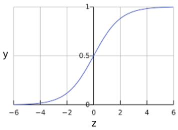

> 学习目标：
>
> - 了解逻辑回归
> - 了解逻辑回归的损失和正则化函数

## 逻辑回归(Logistic Regression)

### 计算概率

许多问题需要将概率估算值作为输出。**逻辑回归**是一种及其高效的概率计算机制。实际上，我们可以使用以下两种方式之一使用返回的概率：

- 保持原样

  **例子**：假设我们创建的一个逻辑回归模型预测了狗在半夜发出叫声的概率:

  $p(bark|night) = 0.05$ , 则在一年时间内，狗叫的次数约为$N_{bark} = p(bark|night)*N_{nights}=0.05 * 365\approx 18$ (次)

- 转换为二元类别

  **例子**：在很多情况下，我们会把逻辑回归的结果映射到二元分类问题上，比如预测邮件是「垃圾邮件」还是「非垃圾邮件」。

**Sigmoid函数**具有把输入值映射到0-1之间的特征，其定义为：$y=\frac{1}{1+e^{-z}}$

它会产生如下曲线:

**图1. Sigmoid函数**(S型函数)

我们用$z$表示逻辑回归模型的线性层输出，则S(z)函数会生成一个介于0-1之间的概率，表示为：

$$y'=\frac{1}{1+e^{(-z)}}$$

其中：

- $y'$是逻辑回归模型针对特定样本的输出

- $z$是$w_0+w_1x_1+w_2x_2+\dots+w_nx_n$

  - $w$是模型学习的权重和偏差
  - $x$是数据样本的特征值

  > 注意：这里的$z$也被称为对数几率，$z$可以定义为标签"1"和标签"0"的概率比值的对数：
  >
  > $$z=log(\frac{1}{1-y})$$

### 模型训练

#### 损失函数

线性回归的损失函数是平方损失函数，逻辑回归的损失函数是**对数损失函数**，定义为：

$$LogLoss = \sum_{(x,y)\in D}{-ylog(y')-(1-y)log(1-y')}$$

其中：

- $(x,y)\in D$是包含很多有样本标签(x,y)的数据集。
- $y$是样本的标签，逻辑回归中必须是0或者1
- $y'$是对特征集x的预测值，介于0-1之间

可以发现，对数损失函数的方程式和香农信息论中的熵测量有密切的关系。它也是似然函数的负对数（假设y属于伯努利分布). 实际上，最大限度地降低损失函数的值会生成最大的似然估计值。

### 正则化

正则化在逻辑回归建模中及其重要。如果没有正则化，逻辑回归的**渐进性**会不断促使损失在高维空间内达到0，所以大多数逻辑回归模型会使用以下策略之一来降低模型复杂性：

- L2正则化
- 早停法，限制训练步数或学习速率。

> 假设我们向每个样本分配一个唯一 ID，且把每个 ID 映射到其自己的特征。如果未指定正则化函数，模型会变得完全过拟合。这是因为模型会尝试促使所有样本的损失达到 0 但始终达不到，从而使每个指示器特征的权重接近正无穷或负无穷。当有大量罕见的特征组合且每个样本中仅一个时，包含特征组合的高维度数据会出现这种情况。

### 总结

- 逻辑回归模型会生成概率
- 逻辑回归的损失函数是对数损失
- 逻辑回归模型被业界广泛使用