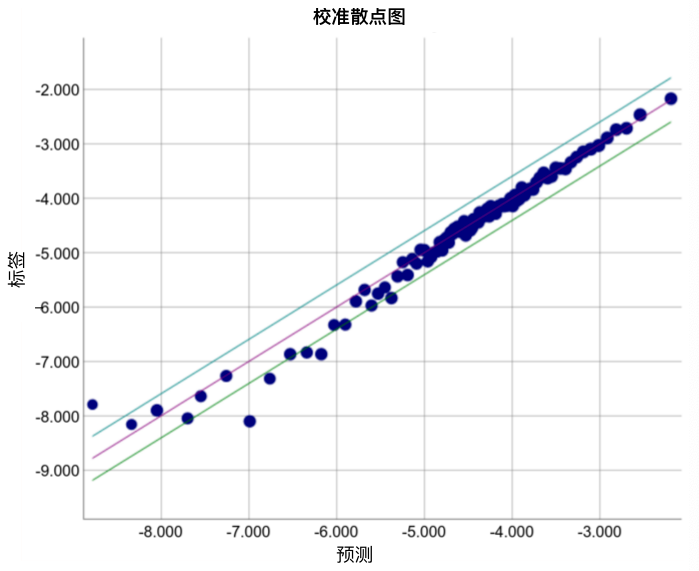

> 学习目标：
>
> - 评估逻辑回归模型的准确率和精确率
> - 了解ROC曲线和曲线下的面积

# 第10节 分类(Classification)

## 10.1. 阈值(threshold)

逻辑回归返回的是概率。我们可以「原样」使用输出的概率，也可以把输出的值转换成二元值。

假如我们的模型判定一封电子邮件是垃圾邮件的概率是0.6，我们应该怎样为其分类呢？

为了将逻辑回归值映射到二元类别，我们必须设置一个分类阈值(也叫判定阈值)。如果值高于阈值，则表示是「垃圾邮件」；反之不是。阈值取决于具体的问题，并不总是0.5。

## 10.2. 真假正负类

我们以「伊索寓言：狼来了」的故事作为背景：

> **伊索寓言：狼来了（精简版）**
>
> 有一位牧童要照看镇上的羊群，但是他开始厌烦这份工作。为了找点乐子，他大喊道：“狼来了！”其实根本一头狼也没有出现。村民们迅速跑来保护羊群，但他们发现这个牧童是在开玩笑后非常生气。
>
> [这样的情形重复出现了很多次。]
>
> 一天晚上，牧童看到真的有一头狼靠近羊群，他大声喊道：“狼来了！”村民们不想再被他捉弄，都待在家里不出来。这头饥饿的狼对羊群大开杀戒，美美饱餐了一顿。这下子，整个镇子都揭不开锅了。恐慌也随之而来。

针对故事，我们定义:

- 「狼来了」是正类别
- 「没有狼」是负类别

则故事中可能出现四种情况：

**真正例**是指模型将正类别样本正确地预测为正类别。同样，**真负例**是指模型将负类别样本正确地预测为负类别。

**假正例**是指模型将负类别样本错误地预测为正类别，而**假负例**是指模型将正类别样本错误地预测为负类别。

## 10.3. 准确率(Accuracy)

**准确率**是我们的模型预测正确的结果占总预测数的比例。

$$Accuracy = \frac{right predictions}{total predictions}$$

对于二元分类，准确率还可以表示如下：

$$Accuracy= \frac{TP+TN}{TP+TN+FP+FN}$$

我们来看一个例子:

> 我们训练了一个肿瘤分类的模型，恶性(**正类别**)，良性(**负类别**)：其中TP=1, FP=1, FN=8, TN=90，则根据上面公式可以得到：$准确率=0.91$。看上去准确率很高，我们的模型是个很好的模型，但可以发现其中FN有8个，总共9个恶性样本，预测错了8个，这是十分可怕的事情！

当我们在使用**分类不平衡的数据集**的时候，单一准确率并不能反映全面的情况。

## 10.4. 精准率和召回率

### 10.4.1. 精准率(Precision)

**精准率**指的是预测的结果是正类别的样本中，正确预测的比例：

$$Precision = \frac{TP}{TP+FP}$$

以上面肿瘤分类结果为例，得到$精准率=\frac{1}{1+1}=0.5.$，也就是说，该模型预测恶性肿瘤方面的正确率是50%。

### 10.4.2. 召回率(Recall)

**召回率**指的是在所有的正类别样本中，被正确预测的比例：

$$Recall = \frac{TP}{TP+FN}$$

以上面肿瘤分类结果为例，得到$召回率=\frac{1}{1+8}=0.11$，也就是说，该模型预测恶性肿瘤方面的召回率是11%。

### 10.4.3. 精准率和召回率之间的「拔河」(Tradeoff)

我们在全面评估一个模型的时候，需要同时检查其精准率和召回率。遗憾的是，他们之间总是存在此消彼长的情况，我们需要很好的权衡并设置一个良好的**分类阈值**。

**图1.分类阈值右侧的被归为垃圾邮件**

根据图一计算精准率和召回率：

| TP: 8 | FP: 2  |
| ----- | ------ |
| FN: 3 | TN: 17 |

则精准率为**被标记为垃圾邮件的电子邮件**中正确预测所占的比例：

$$Precision=\frac{8}{8+2}=0.8$$

召回率为**所有实际垃圾邮件**中被正确预测所占的比例：

$$Recall=\frac{8}{8+3}=0.73$$

### 10.4.4. 分类阈值的调整

根据图1，

- 我们把分类阈值往右侧移动，**假正例减少**，但是相应**假负例增多**。结果造成**精准率提高**，但是**召回率下降**
- 我们把分类阈值往左侧移动，**假正例增加**，但是相应**假负例减少**。结果造成**精准率降低**，但是**召回率提高**

### 10.4.5. 性能指标

我们根据精准率和召回率制定了不同的指标：

**F1分数**定义为:

$$F_1 = (\frac{Recall^{-1}+Precision^{-1}}{2})^{-1} = 2\cdot\frac{Precision\cdot Recall}{Precision+Recall}$$

0表示最差，1表示最好。

## 10.5. ROC曲线和曲线下面积

### 10.5.1 ROC曲线(Reciever Operating Characteristic)

**ROC曲线(接收者操作特征曲线)**是一种显示分类模型在所有分类阈值下的效果的图表。模型绘制了以下两个参数：

- 真正例率
- 假正例率

**真正例率(TPR)**是召回率的同义词，定义为：

$$TPR=\frac{TP}{TP+FN}$$

**假正例率(FPR)**定义如下：

$$FPR=\frac{FP}{FP+TN}$$

ROC曲线用于绘制不同分类阈值的TPR和FPR。降低分类阈值会导致将更多样本归为正类别，从而增加假正例和真正例的个数。

**图2. 不同分类阈值下的TPR和FPR**

为了计算ROC曲线上的点，我们可以使用不同的分类阈值多次评估逻辑回归模型，但这样做的效率很低。

我们可以使用一种基于排序的高效算法来提供此类的信息，这种算法称：**曲线下面积**。

### 10.5.2. 曲线下面积(Area Under the Curve of ROC)

**ROC曲线下面积(AUC)**即图中灰色二维面积，可使用积分计算。

**图3. ROC曲线下面积**

曲线下面积对所有可能的分类阈值的效果进行综合衡量。曲线下面积的一种解读方式可以看做模型将某个随机正类别样本排列在某个随机负类别样本之上的概率。

以下面的样本为例，逻辑回归预测值从左到右升序排列：

**图4. 预测按逻辑回归分数从左到右升序排列**

曲线下面积表示随机正类别(绿色)样本位于随机负类别(红色)样本右侧的概率。若随机抽取一个正样本和一个负样本，分类器**正确判断**正样本的值高于负样本之**机率** =AUC

曲线下面积的取值范围是0-1。 预测结果100%错误的模型曲线下面积为0.0；而100%正确的模型曲线下面积为1.0。AUC值越大，模型正确率越高。AUC值在0.5-1.0之间的模型，是有意义的；AUC=0.5的模型是没有意义的。AUC=1则表明模型是一个完美分类器，我们往往应该对此存疑(在实践中通常不存在)。

曲线下面积有以下两个原因而比较实用：

- 曲线下面积的**尺度不变**，它衡量的是预测的排名情况，而不是测量其绝对值，
- 曲线下面积的**分类阈值不变**，它衡量的是模型预测的质量，而不考虑所选的分类阈值。

这两个原因都有它的局限性，

- **并非总是希望尺度不变**。有时我们需要良好校准的概率输出。
- **并非总是希望分类阈值不变**。当假负例和假正例的代价存在较大差异时，尽量减少一种类型的分类错误可能至关重要。比如垃圾邮件分类，我们希望优先减少假正例。

## 10.6. 预测偏差(Prediction-bias)

逻辑回归预测应当无偏差。即：

> **预测平均值**应当约等于**观察平均值**

**预测偏差**指的是这两个平均值之间的差值。即：

预测偏差=预测平均值-数据集中相应标签的平均值

> ⚠️注意：**预测偏差**不是**wx+b**中的**b**

如果出现非常高的**非零预测偏差**，说明我们的模型某处存在错误，表明模型对正类别标签的出现频率预测有误。

> 例如我们假设所有的电子邮件中，有1%的邮件是垃圾邮件，而一个出色的模型应该可以预测到电子邮件平均有1%的可能性是垃圾邮件。假如模型给出的可能性是20%，则表明模型出现了预测偏差。

造成预测偏差的可能原因包括：

- 特征集不完整
- 数据集混乱
- 模型实现流水线中有错误？
- 训练样本有偏差
- 正则化过强

假如模型出现了预测偏差，我们可以后期添加校准层来降低偏差。但此非良策。理由如下：

- 治标不治本
- 系统变得更加脆弱，模型更新使得校准层必须持续更新

如果可以的话，我们应当尽量避免添加校准层。

> ⚠️注意：出色的模型偏差通常接近于零。但是，预测偏差低并不能证明模型出色，较差的模型的预测偏差也可能为零。

### 10.6.1. 分桶偏差和预测偏差

逻辑回归可以预测0-1之间的值。不过，所有带标签的样本都正好是0或者1。因此在检查偏差时，我们不能仅根据一个样本就准确地确定偏差，我们必须要在「一大桶」样本中检查预测偏差。(也就是说把足够的样本组合在一起以便能够比较预测值和观察值，逻辑回归的预测偏差才有意义。）

我们可以通过以下的方式构建桶：

- 以线性方式分解目标预测
- 构建分位数

下面是某个特定模型的校准曲线。每个点表示1000个值的分桶。

- x轴表示模型针对该桶预测的平均值

- y轴表示该桶数据集的实际平均值

- > 两个轴均采用对数尺度

**图5. 预测偏差曲线(对数尺度)**

我们发现对于左侧部分，模型做出的预测很差，以下是造成这样情况的几种可能：

- 训练集不能充分表示数据空间的某些子集
- 数据集的某些子集比其他子集更混乱
- 模型过于正则化(尝试减小Lambda的值)

编程参见[classification.ipynb](../code/classification.ipynb)

