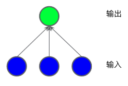

## 神经网络简介

### 介绍

我们可以发现下面的分类问题属于非线性问题：

**图1. 非线性分类问题**

非线性意味着我们不能使用如下形式的模型$b+w_1x_1+w_2x_2$来准确预测标签。也就是说，「决策面」不是直线。我们需要添加特征组合，如$x_1x_2$这样的特征。

但假如我们遇到更复杂的非线性分类问题呢？如下：

**图2.更难的非线性问题**，无法用线性模型解决

神经网络如何帮助解决非线性问题，我们先来看一个线性模型：

**图3. 线性模型**

上面的图表展示的模型是线性模型，我们为其添加隐藏层。

**图4.三层模型**

此模型尽管添加两层隐藏层，但其依旧是线性模型，不能解决上述非线性问题。

### 激活函数

要对非线性问题进行建模，我们可以直接引入非线性函数，如**图5**所示:

**图5. 包含激活函数的三层模型**，非线性转换层通常不绘制

在隐藏层1的各个节点的值传到下一层进行加权求和之前，先通过一个非线性函数进行转换，这种非线性函数称为**激活函数**。

#### 常见激活函数

- **Sigmoid(S型函数)**

  > 把加权求和转换为介于0~1之间的值

  $$F(x) = \frac{1}{1+e^{-x}}$$

  

  **图6. Sigmoid激活函数**

- **ReLU(修正线性单元)**

  > 效果通常好于Sigmoid函数，易于计算

  $$F(x)=max(0,x)$$

  

  **图7.ReLu激活函数**

- **tanh(双曲正切)**

  > 以0为中心，输入输出在(-1, 1)之间

  $$tanh(x)=\frac{sinh(x)}{cosh(x)}=\frac{e^x-e^{-x}}{e^x+e^{-x}}$$

  

  **图8.tanh激活函数**

实际上，所有的数学函数都可以作为激活函数。

### 初始化

神经网络初始化十分重要.

### 特征工程

即使是神经网络，有时候我们也需要特征工程，比如拟合螺旋曲线时，我们可以组合特征。

### 小结

> 神经网络的标准组件有如下：

- 一组**节点**，类似于神经元，位于层中
- 一组**权重**，表示每个神经网络层与下一层之间的关系。
- 一组**偏差**，每个节点一个偏差
- **激活函数**，对层中每个节点的输出进行转换。不同的层可能拥有不同的激活函数

编程参见：[intro_to_neural_networks.ipynb](../code/intro_to_neural_networks.ipynb)