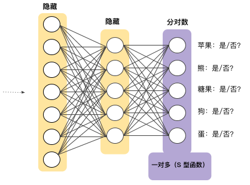
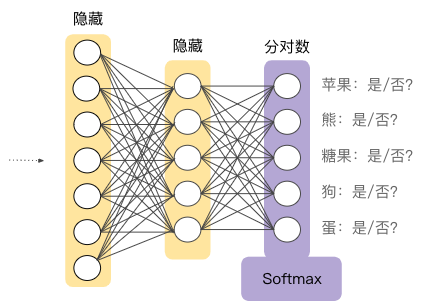

> 学习目标：
>
> - 理解多类别分类问题，尤其是 Softmax
> - 在 TensorFlow 中制定 Softmax 解决方案

## 多类别神经网络

### 一对多

**一对多**提供了一种利用二元分类的方法。一个分类问题假如给定了N个可预测的标签，我们就可以训练N个二元分类器，使得每个分类器都可以回答特定的问题。

如以下例子，我们将一张小狗的照片作为正样本，那么对其它4个分类器来说，它就是负样本：

| 标签？ | 0/1 (表示「不是」和「是」) |
| ------ | -------------------------- |
| 苹果   | 0                          |
| 熊     | 0                          |
| 糖果   | 0                          |
| 小狗   | 1                          |
| 鸡蛋   | 0                          |

**注意**：在类别总数较少的时候，这种方法比较合理，随着类别数量增加，其效率会变得越来越低下。

我们可以借助深度神经网络来创建更加高效的一对多模型。

**图1. 一对多神经网络**，每个输出节点对应一个不同的类别

### Softmax

我们知道，逻辑回归可以生成介于0.0~1.0之间的小数。

Softmax想把这一想法延伸到多类别领域。也就是说，Softmax会为每个类别分配一个用小数表示的概率，这些概率求和的结果必须为1.0，**这种附加的限制会有助于让训练过程更快收敛**。

如： Softmax可能会得出图片属于某一特定类别的概率

| 标签？ | 概率  |
| ------ | ----- |
| 苹果   | 0.001 |
| 熊     | 0.04  |
| 糖果   | 0.008 |
| 小狗   | 0.95  |
| 鸡蛋   | 0.001 |

**Softmax层**是紧挨着**输出层之前**的神经网络层。Softmax层和输出层拥有一样的节点数。如图2所示:

**图2. 神经网络中的Softmax层**

Softmax公式如下：

$$p(y=j|x)=\frac{e^{w_j^Tx+b_j}}{\sum_{k\in K}e^{w_k^Tx+b_k}}$$

> **注意**：公示的本质其实是把逻辑回归公式延伸到了多类别

### Softmax选项

- **完整Softmax**，即我们前面讨论的Softmax，也就是说对每个可能的类别计算概率。

- **候选采样**，指Softmax针对**所有**的正类别标签计算概率，但仅针对负类别标签的**随机样本**计算概率。

  > 例如，如果我们想要确定某个输入图片是小猎犬还是寻血猎犬图片，则不必针对每个非狗狗样本提供概率。

#### 为什么采用候选采样？

之所以采用候选采样的方法，在于当类别数量较少时，完整的Softmax代价很小，但随着类别数量增多，代价会变得高昂。**候选采样**可以提高处理大量类别的问题的效率。(提高效率)

### 一个标签与多个标签

Softmax假设每个样本只能属于一个类别。但是，一些样本可以同时被分类为多个类别，对于这种情况：

- 我们不能使用Softmax
- 模型必须依赖多个逻辑回归

例如：

> 假设我们的样本是只包含一项内容（一块水果）的图片。Softmax 可以确定该内容是梨、橙子、苹果等的概率。
>
> 但如果我们的样本是包含各种各样内容（几碗不同种类的水果）的图片，我们必须改用多个逻辑回归。

编程参见[mnist.ipynb](../code/mnist.ipynb)