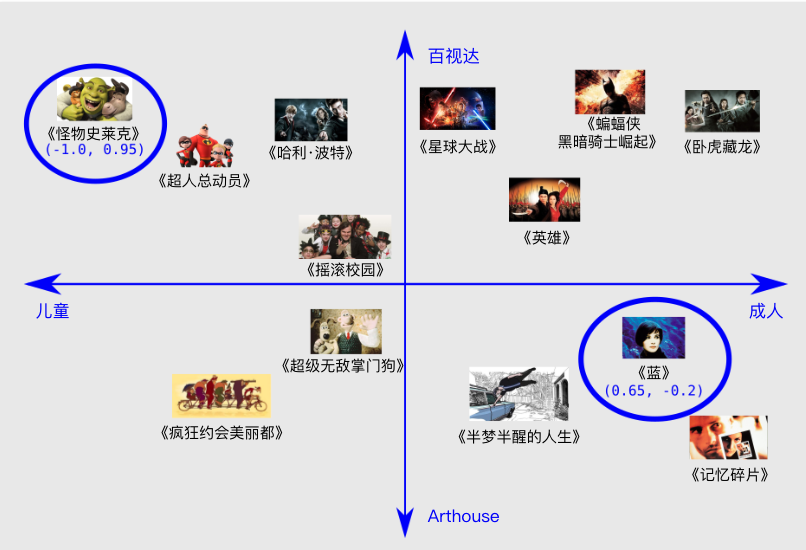
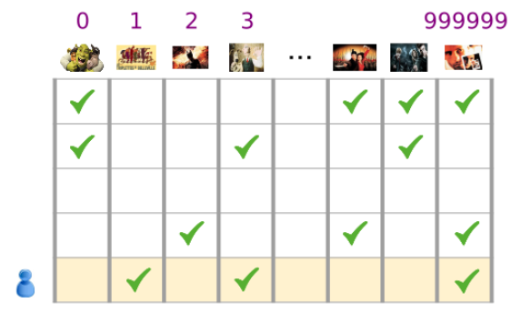
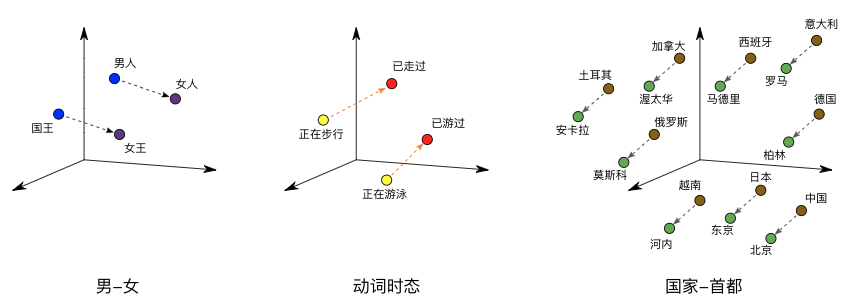
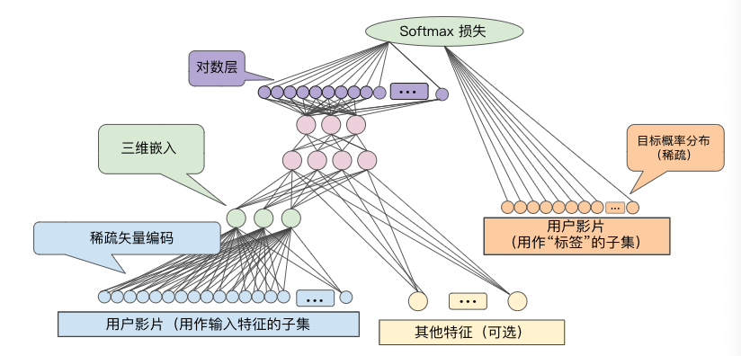
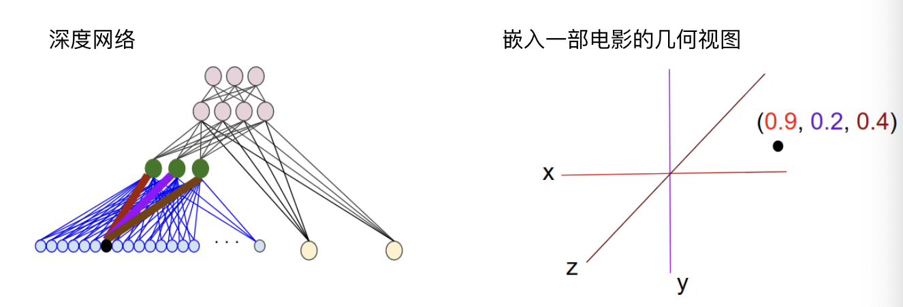

> 学习目标：
>
> - 学习嵌入的定义和用途
> - 学习嵌入如何编码语义关系
> - 学习如何使用嵌入
> - 学习如何训练有意义的嵌入

## 嵌入(Embedding)

- 什么是嵌入？

  **嵌入**是一种相对低维的空间，您可以将高维矢量映射到这种低维空间里

- 为什么使用嵌入？

  通过使用嵌入，可以让在大型输入（比如代表字词的稀疏矢量）上进行机器学习变得更加容易。在理想情况下，嵌入可以将语义上相似的不同输入映射到嵌入空间里的邻近处，以此来捕获输入的语义。一个模型学习到的嵌入，也可以被其他模型重用。

### 协同过滤(Collaborative Filtering)

**协同过滤**是一项可以预测用户兴趣(根据很多其他用户的兴趣)的任务。

> 比如我们要为用户推荐影片，我们已有的信息是用户及其观看过的影片列表。

学习**嵌入**之前需要我们学习如何去**表示训练数据**。

#### 在一维数轴上排列影片

| 影片                                                         | [分级](https://wikipedia.org/wiki/Motion_Picture_Association_of_America_film_rating_system#MPAA_film_ratings) | 说明                                                         |
| ------------------------------------------------------------ | ------------------------------------------------------------ | ------------------------------------------------------------ |
| [《蓝》](http://www.imdb.com/title/tt0108394/)               | R                                                            | 一位法国妇人在丈夫与爱女丧命于一场车祸后悲痛欲绝。           |
| [《蝙蝠侠：黑暗骑士崛起》](http://www.imdb.com/title/tt1345836) | PG-13                                                        | 这部影片是[《黑暗骑士》](http://www.imdb.com/title/tt0468569/)的续集，以 DC 漫画的宇宙空间为背景，讲述蝙蝠侠尽力保护高谭市免遭核毁灭的故事。 |
| [《哈利·波特与魔法石》](http://www.imdb.com/title/tt0241527/) | PG                                                           | 一个失去双亲的男孩发现自己会巫术，于是前去霍格沃茨魔法学校学习魔法，在这里他与邪恶的伏地魔展开了第一场激斗。 |
| [《超人总动员》](http://www.imdb.com/title/tt0317705/)       | PG                                                           | 被迫在郊区过着平民生活的超人一家重出江湖，拯救超人家族免遭辛拉登及其杀手机器人的迫害。 |
| [《怪物史莱克》](http://www.imdb.com/title/tt0126029/)       | PG                                                           | 可爱的怪物史莱克和他的伙伴驴子，启程营救被火龙囚禁在城堡的菲奥娜公主。 |
| [《星球大战》](http://www.imdb.com/title/tt0076759)          | PG                                                           | 卢克·天行者和汉·索洛与两个义军机器人结成一队，共同拯救莱娅公主并保卫星球。 |
| [《疯狂约会美丽都》](http://www.imdb.com/title/tt0286244)    | PG-13                                                        | 专业骑行者查宾在环法自行车大赛期间被挟持，他的奶奶带着他家的胖狗漂洋过海，并在爵士歌手三姐妹的帮助下救出了他。 |
| [《记忆碎片》](http://www.imdb.com/title/tt0209144/)         | R                                                            | 一位短期记忆丧失症患者将线索纹在身上，竭尽全力寻找杀害自己妻子的凶手。 |

- **一个可行(但不完善)的解决方案**

**图1. 一种可行的一维排列**，这种排列更多的捕捉了电影的分级(适合儿童还是成人)，但实际中还需要考虑影片的许多特征。

#### 在二维空间排列影片

**图2.一种可行的二维排列**

在二维平面上，定义影片之间的距离，采取了「适合观影人群」和「影片类型」(商业片还是艺术片)两种重要特征，让两种特征更相似的影片位于更近的位置。

更笼统的说，我们所做的是把这些影片映射到了**嵌入空间**，其中每一个字词都由一组二维坐标来表示。通常情况下，学习d维嵌入时，每部影片都由d个实值数字表示，一个数字表示在一个维度中的坐标。

> 在学习嵌入时，每个维度的学习跟它们的名字无关。有时我们可以查看嵌入并为维度赋予语义，但有时则无法做到。通常，每个**此类维度**都称为一个**潜在维度**，因为它代表的特征没有明确显示在数据中，而是要根据数据推断得出。
>
> 最终，**真正有意义的是**嵌入空间中各个影片之间的**距离**，而不是单个影片在任意指定维度上的坐标。

#### 分类输入数据(Categorical Input Data)

**分类数据**是指用于表示一组有限选项中的一个或多个离散项的输入特征。

> 例如，它可以是某用户观看过的一组影片，某文档中使用的一系列单词，或某人从事的职业。

分类数据的最高效表示方式是使用**稀疏张量**含有极少非零元素的张量。

> 例如，我们可以为每部可能的影片分别分配一个唯一的ID，然后通过用户已观看影片的稀疏张量来表示每位用户。

**图3. 影片推荐问题的数据**

在图3中，每一行都代表一个用户的影片观看记录样本。如最后一行就对应于稀疏张量[1, 3, 999999]。

同样，我们可以把字词、句子和文档表示为稀疏张量，这种情况下，词汇表的每个字词所扮演的角色就类似于上面示例中的影片。

为了在机器学习系统中使用这类表示法，我们需要把每个稀疏矢量表示为数字矢量，**使得语义上相似的项在矢量空间中具有相似的距离**。

#### 如何将字词表示为数字矢量？

- **独热编码(one-hot encoding)**：最简单的做法，定义一个巨型输入层，为**词汇表中的每个字词**设定一个节点，或者至少为我们数据中**出现的每个字词**设定一个节点。

  > 例如，我们有50万个单词，那么我们就使用长度为50万的矢量来表示每个单词，单词根据索引把矢量对应位置设为1，其它位置为0。

- **词袋编码(bag of words)**: 更常见的做法，是使用一个包含各个单词在大块文本中出现的次数的向量。

  > 在一个词袋矢量中，50万个节点中会有多个节点具有非零值。

无论怎样确定非零值，如果把节点和字词一一对应，我们得到的输入矢量就会比较稀疏，即：矢量很大，但非零值相对较少。

#### 稀疏表示法存在以下问题：

- 网络的规模
巨型输入矢量意味着神经网络的对应权重数目会极其庞大。会进一步引发以下问题:
1. **数据量**：模型权重越多，高效训练需要的数据就越多。	
  
2. **计算量**：权重越多，训练和使用模型需要的计算能力要求就越高。

- 矢量之间缺乏有意义的联系

> 如果您已将 RGB 通道的像素值馈入到图片分类器中，分析“邻近”值便行得通。不管是从语义上来看，还是从矢量之间的几何距离来看，红蓝色与纯蓝色都是邻近的。不过，对于在索引 1247 处设为 1 以表示“马”的矢量而言，如果说它与在索引 238 处设为 1 以表示“电视机”的矢量不够邻近，那么它与在索引 50430 处设为 1 以表示“羚羊”的矢量亦然。

#### 解决方案：嵌入

我们可以通过**嵌入**来解决上述问题，也就是把==大型稀疏矢量映射到一个保留语义关系的低维空间==。

### 转换到低纬度空间(Translating to The Lower Dimensional Space)

要解决稀疏输入数据的核心问题，我们可以把高维数据映射到低维空间。

通过这样的嵌入，我们把语义上相似的项归到一起，并把相异项分开。矢量空间中的位置(距离和方向)可以对良好嵌入的语义进行编码。如下图所示:

**图4. 嵌入可视化**

借助这样有意义的空间，机器学习系统能够检测出对学习任务可能有帮助的模式。

#### 收缩网络

我们需要在「足够的维度编码丰富的语义」和「足够小的嵌入空间快速训练」中很好的权衡，通常几百个维度的嵌入比较实用，而比起NLP(自然语言处理)任务中使用的词汇规模小好几个数量级。

#### 嵌入充当查询表

嵌入是一个矩阵，每列表示我们词汇中的一项对应的矢量。要获得某个词汇项的密集矢量，我们可以检索该项所对应的列。

要转换多个词汇的稀疏矢量为密集矢量，我们可以检索各项的嵌入，然后相加。如果词汇包含计数，则先相乘再相加求和。

#### 嵌入查询充当矩阵乘法

> 我们刚刚阐述的查询、乘法和加法程序等效于矩阵乘法。假设有一个 1 X N 的稀疏表示 S 和一个 N X M 的嵌入表 E，矩阵乘法 S X E 可以得出密集矢量 1 X M。

这里的问题，==**是获得嵌入表E**==。

### 获得嵌入(Obtaining Embeddings)

我们可以通过多种方式来获取嵌入，==**包括Google研发的世界一流算法**==

#### 标准降维技术(Standard Dimensionality Reduction Techniques)

现在已有许多数学手段可以在低维空间捕获高维空间的重要结构，理论上，这些技术都可以用作机器学习系统中来构建嵌入。

> 例如，[主成分分析](https://wikipedia.org/wiki/Principal_component_analysis) (PCA) 已用于创建字词嵌入。在给定一组实例的情况下，例如字词矢量包，PCA 会尝试查找高度相关且可以合并的维度。

#### Word2Vec

> Word2vec 是 Google 为了训练字词嵌入而研发的一种算法。Word2vec 基于**分布假设**，将语义上相似的字词映射到在几何图形上邻近的嵌入矢量。
>
> 分布假设指出经常具有相同相邻字词的字词往往在语义上相似。如：「狗」和「猫」这两个字词经常靠近「兽医」一词出现，这就可以说明这两个字词在语义上相似。
>
> Word2Vec 通过训练神经网络来区分实际共同出现的多组字词与随机出现在一起的字词，从而充分利用此类上下文信息。输入层采用一种稀疏表示法用于组合一个目标字词与一个或多个上下文字词。这一输入层会连接到一个较小的隐藏层。
>
> - 在其中一版算法中，系统通过用随机噪点字词替代目标字词来举出反面示例。在给出正面示例“the plane flies”的情况下，系统可能会换成“jogging”来创建对比鲜明的反面示例“the jogging flies”。
>
> - 另一版算法通过将真实的目标字词与随机选择的上下文字词配对来创建反面示例。因此，系统可能会举出正面示例（(the, plane)、(flies, plane)）和反面示例（(compiled, plane)、(who, plane)），然后通过学习分辨哪几对真正地在文字中一起出现。
>
> 不过，分类器不是上述任何一版算法的真正用途。在训练模型后，你得到的是一组嵌入。借助将输入层连接到隐藏层的权重，您可以将字词的稀疏表示映射到小型矢量。这类嵌入可在其他分类器中重复利用。
>
> 要详细了解 word2vec，请参阅 [tensorflow.org 上的教程](https://www.tensorflow.org/tutorials/word2vec/index.html)

#### 将嵌入训练为大型模型的一部分

我们可以把嵌入作为神经网络的一部分进行学习。通过这样的方法，我们可以为自己的铜锭系统量身定制嵌入，不过耗费的时间可能比单独训练嵌入的时间更长。

一般来说，我们具有稀疏数据时，我们可以创建一个**嵌入单元**，这个嵌入单元其实是大小为d的一个**特殊类型的隐藏单元**。此嵌入层可以和其他任何特征和隐藏层组合。和其它任何DNN中一样，最终层是要**优化的损失函数**。

> 例如，假设我们正在执行协同过滤，目标是根据其他用户的兴趣预测某位用户的兴趣。我们可以把这个问题进行监督式学习问题进行建模，具体做法是随机选取用户观看过的一部分影片作为正类别标签，然后再优化损失。架构如图5所示：

**图5. 根据协同过滤数据学习影片嵌入的DNN架构示例**

再举一个例子，如果我们想在DNN中针对房地产广告词创建嵌入层来预测房价，我们可以把训练数据中的已知房屋售价作为标签来优化L2损失。

在学习d维嵌入时，每一项都会映射到d维空间的一个点，这样相似项就会在该空间内彼此邻近。

图6说明了在嵌入层中学到的权重与几何视图之间的关系。输入节点与d维嵌入层中的节点之间的边的权重对应于d维坐标轴中每一维的坐标值。

**图6.嵌入层权重的几何视图**