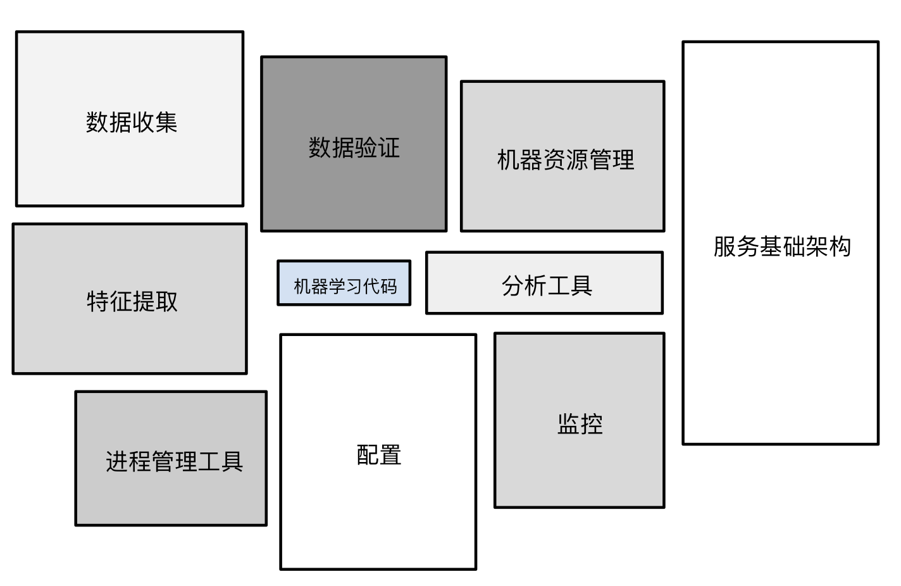

> 学习目标：
>
> - 了解生产环境机器学习系统中的组件
> - 了解动态与静态训练
> - 了解动态与静态推理
> - 了解生产环境机器学习系统中的数据依赖问题

## 机器学习工程(Machine Learning Engineering)

### 生产环境下的机器学习系统(Production ML System)

> 除了机器学习算法以外，机器学习还包括许多其他内容。生产环境机器学习系统包含了大量组件。

当然，如何构建模型来预测从未见过的新数据是任何机器学习系统的核心部分。但对于机器学习整个生态系统来说，它不过是其中一个执行机器学习任务的小黑盒子，整个系统还包括很多与训练无关的组件。

**图1.机器学习系统的生态**

例如，我们通常还需要做以下的事情：

- 数据收集
- 特征提取
- 数据验证
- 各种形式的监控
- 数据分析

我们需要把这些信息整合起来，以便做出对现实世界有用的预测，这就涉及到了很多不同的组件了。

幸运的是，在实际操作中，我们不必自己构建这些组件，有大量现成的组件供我们在特定的场景中使用。(考虑是否值得造轮子)

下面我们将给出一些选择组件的参考。

### 静态训练与动态训练(Static vs. Dynamic Training)

从广义上来讲，训练模型的方式有两种：

- **静态模型**采用离线训练方式。也就是说，我们只训练模型一次，然后使用训练后的模型。
- **动态模型**采用在线训练方式。也就是说，数据会不断进入系统，我们通过不断地更新系统将这些数据整合到模型中。

这两种方式各有利弊，

**静态模型 - 离线训练**

- ✅ 优点：易于构建和测试 - 使用批量训练和测试，对其进行迭代，直到达到良好效果。

- ❌缺点： 仍然需要对输入进行监控 - 如果输入的分布发生了变化，而我们的模型尚未适应这种变化，最终可能就会出现异常的预测结果。
- ❌缺点： 模型容易过时。

**动态模型 - 在线训练**

- 随着时间推移不断为训练数据注入新数据，定期同步更新版本。

- 使用渐进式验证，而不是批量训练和测试

- ❌缺点：更复杂的系统，包括更强的监控、模型回滚和数据隔离功能

- ✅优点：会根据变化作出相应调整，避免了过时问题

- > 在线训练的模型可能更适合 随时间推移常有趋势和季节性变化的情况， 我们会希望确保模型尽可能反映出最新变化。

### 静态推理与动态推理(Static vs. Dynamic Inference)

我们可以使用任一推理策略：

- **静态 - 离线推理**，指的是使用 MapReduce 或类似方法批量进行所有可能的预测。然后，将预测记录到 SSTable 或 Bigtable 中，并将它们提供给一个缓存/查询表。
- **动态 - 在线推理**，指的是使用服务器根据需要进行预测。

这两种策略也各有利弊：

**静态 - 离线推理**

- 使用 MapReduce 或类似方法批量进行所有可能的预测。
- 记录到表格中，然后提供给缓存/查询表。
- ✅优点：不需要过多担心推理成本。
- ✅优点：可以使用批量方法。
- ✅优点：可以在推送之前对数据预测执行后期验证。
- ❌缺点：只能对我们知晓的数据进行预测，不适用于存在长尾或极端的情况。
- ❌缺点：更新可能延迟数小时或数天。

**动态 - 在线推理**

- 使用服务器根据需要进行预测。
- ✅优点：可在新项目加入时对其进行预测，非常适合存在长尾的情况。
- ❌缺点：计算量非常大，对延迟较为敏感，可能会限制模型的复杂度。
- ❌缺点：监控需求更多，不仅要监测数据工作本身，还要监控预测的输出分布，确保不会发生故障。

### 数据依赖关系(Data Dependencies)

> **数据之于机器学习开发者的重要性等同于代码之于传统编程人员的重要性。**

回忆一下，我们在编写软件代码时，我们都希望尽量减少对外部的依赖关系。在创建机器学习模型时也是如此，我们希望包含尽可能少的数据依赖关系，我们这里说的**数据依赖关系就是指用于训练和预测的输入特征**。

#### 特征管理

- 输入数据（特征）决定机器学习系统的行为。

  > 输入特征发生变化，系统行为也会随之变化。

- - 我们可以针对软件库编写单元测试，但数据呢？

- 选择输入信号时要谨慎。

- - 甚至比决定要依赖哪个软件库时更谨慎吗？

#### 针对输入数据的问题

数据没有与代码单元测试相媲美的测试，但是我们可以列一份检查清单：

- 可靠性

  - 数据可靠吗？
  - 这些我要用到的数据是否始终会在我需要的时候以同样的方式生成？

- 版本控制

  - 特征是否会随着时间推移发生变化？
  - 我们是否要考虑可特征的各种版本，使用一个布尔指示器？

- 必要性

  - 信号的实用性是否能证明值得添加此信号？

  - 添加新特征便会增加系统的长期维护成本，因此添加新特征所获得的效果与付出的代价相比，是否划算？

- 相关性

  - 特征确实是我们认为存在因果关系的特征，还是只是碰巧具有相关性？
  - 此类特征如果发生变化我们是否会知晓？
  - 可以向系统注入随机性的方式梳理这样的相关性，**这是一种很重要的策略**。

- 反馈环

  - 哪个输入信号可能会受到我的模型输出的影响？

  - 我们使用一个例子来解释:

    > 我们有两个来自不同公司的股票市场预测模型，如果一个预测模型存在错误，则可能导致某只股票价格上涨。
    >
    >
    >
    > 而另一家公司也在关注这方面，并学习了这些数据，其行为也可能会发生变化。
    >
    > 因此，系统A中的错误事实上可能会改变系统B产生错误的行为，即使这两个系统确实来自不同的公司，完全没有共同元素。
    >
    >
    >
    > 由此看，反馈环是确实存在的，我们要想方设法跟踪并考虑它们。

  - 更多例子：

    - 大学排名模型 - 将选择率（即申请某所学校并被录取的学生所占百分比）作为一项学校评分依据。

      > 此模型的排名可能会提高学生对高评分学校的兴趣，从而使这些学校收到的申请增加。如果这些学校录取的学生人数继续保持不变，则选择率会增大（录取的学生所占百分比会下降）。这样会提升这些学校的排名，从而进一步提高未来有意申请这些学校的学生的兴趣，如此循环下去…

    - 图书推荐模型 - 根据小说的受欢迎程度（即图书的购买量）向用户推荐其可能喜欢的小说。

      > 图书推荐有可能吸引用户购买，而且这些额外销量将作为输入项反馈回模型，从而使该模型更有可能在将来推荐同样的图书。

    - 交通状况预测模型 - 使用海滩上的人群规模作为特征之一预测海滩附近各个高速公路出口的拥堵情况。

      > 有些准备前往海滩的游客可能会根据交通状况预测结果来制定出行计划。如果海滩上人群规模很大且交通预计会拥堵，则许多人可能会另做打算。这样一来，海滩上游客的数量就会减少，进而使模型作出交通畅通的预测，然后这又会导致前往海滩的游客增加，这样，这个循环就会反复下去。