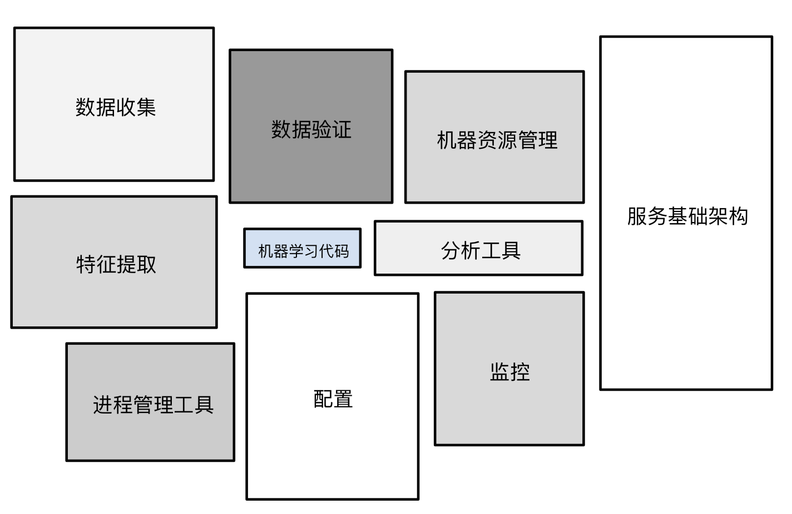

> 学习目标：
>
> - 了解生产环境机器学习系统中的组件

## 机器学习工程(Machine Learning Engineering)

### 生产环境下的机器学习系统(Production ML System)

> 除了机器学习算法以外，机器学习还包括许多其他内容。生产环境机器学习系统包含了大量组件。

当然，如何构建模型来预测从未见过的新数据是任何机器学习系统的核心部分。但对于机器学习整个生态系统来说，它不过是其中一个执行机器学习任务的小黑盒子，整个系统还包括很多与训练无关的组件。

**图1.机器学习系统的生态**

例如，我们通常还需要做以下的事情：

- 数据收集
- 特征提取
- 数据验证
- 各种形式的监控
- 数据分析

我们需要把这些信息整合起来，以便做出对现实世界有用的预测，这就涉及到了很多不同的组件了。

幸运的是，在实际操作中，我们不必自己构建这些组件，有大量现成的组件供我们在特定的场景中使用。(考虑是否值得造轮子)

下面我们将给出一些选择组件的参考。

### 静态训练与动态训练(Static Training vs. Dynamic Training)

从广义上来讲，训练模型的方式有两种：

- **静态模型**采用离线训练方式。也就是说，我们只训练模型一次，然后使用训练后的模型。
- **动态模型**采用在线训练方式。也就是说，数据会不断进入系统，我们通过不断地更新系统将这些数据整合到模型中。

这两种方式各有利弊，

**静态模型 - 离线训练**

- ✅ 易于构建和测试 - 使用批量训练和测试，对其进行迭代，直到达到良好效果。

- ❌ 仍然需要对输入进行监控 - 如果输入的分布发生了变化，而我们的模型尚未适应这种变化，最终可能就会出现异常的预测结果。
- ❌ 这种模型也很容易过时。

