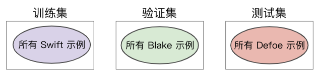

> 学习目标：
>
> - 确定应用于现实世界的机器学习模型中的缺陷

# 第17节 机器学习系统在现实世界里的应用(ML Systems in the Real World)

## 17.1. 癌症预测

### 17.1.1. 背景

- 模型经过训练后可以根据病历来预测“病人患有癌症的概率”
- 特征包括病人年龄、性别、之前的病史、医院名称、生命体征、检验结果
- 模型在处理预留检验数据方面表现出色
- 但模型在针对新病人进行预测时表现却很糟糕，这是为什么呢？

> 我们可以发现，模型中包含了一个特征是「医院名称」，而有的医院名称类似于「贝斯以色列癌症中心」，其实这样的特征可以更清楚地表明患者是否患有癌症(医院名称中包含「癌症」这样的字眼)，即使这样的特征被转换成了数值特征，也会给模型带来微妙的欺骗性，我们称这样的情况为**标签泄露**，在实际应用中我们务必避免。

## 17.2. 18世纪文学

### 17.2.1 背景

- 18 世纪文学教授想仅仅根据作者使用的“思想隐喻”来预测作者的政治派别。
- 研究小组建立了一个大型的有标签数据集（其中逐句纳入了许多作者的作品），并将其拆分成了训练集/验证集/测试集。
- 训练后的模型在根据测试数据进行预测时的表现几近完美，但研究人员却怀疑结果的准确性。可能出了什么问题？

我们考虑，数据拆分方式出现了问题？

- 数据拆分方式 A：研究人员将每位作者的一些样本放在训练集中，一些放在验证集中，另一些放在测试集中。

  

> 以Samuel L. Richardson的句子为例， 他的一些句子会归入训练数据，一些句子会归入验证数据， 还有一些会归入测试数据。这意味着，该模型可以了解Richardson在语言使用方面的特质， 而不仅仅是了解他使用的隐喻手法。

- 数据拆分方式 B：研究人员将每位作者的所有样本都放在单个集中。

  

> 在进行这次实验的过程中，我们发现根据测试数据得出较高的准确率要难得多， 而且仅根据隐喻数据来预测政治派别也难得多。

### 17.2.2. 结果

根据数据拆分方式 A 训练的模型比根据数据拆分方式 B 训练的模型的准确率要高得多。

### 17.2.3. 结论

仔细考虑如何拆分样本，需要我们了解数据代表的含义。

## 17.3. 有效的机器学习应用准则(Effective Machine Learning Guidelines)

1. 当我们创建第一个模型的时候，要确保是一个极其简单的模型。

2. **简单的线性模型**是一个很好地开始，方便我们验证管线的正确性。

3. 在对模型质量进行任何迭代之前，我们需要确保端到端的数据管线是完全正确的，因为数据管线中存在的错误很难跟踪排查。

4. 在训练和评估的最初阶段，我们需要使用一个可观察的简单指标，以验证相应模型的行为是否符合我们的预期。

5. 对输入特征进行监控，将模型配置视为代码，做好记录。

6. 记下所有的实验结果，哪怕是失败的结果，这对后续的调试及其重要。

## 导航

 [返回目录](../README.md) | [上一节 16-ml_engineering](./16-ml_engineering.md) | [下一节 18-next_steps](./18-next_steps.md)