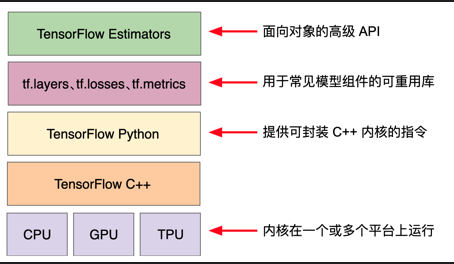

> 学习目标：
>
> - TensorFlow和Pandas的一些基本操作
> - 使用TensorFlow高级API

## 使用TensorFlow工具包

- 层次结构

  

- TF由下面两个组件组成
  - 图协议缓冲区
  - 执行图的运行时
  > 这两个组件类似于Java编译器和JVM

```tf.estimator```与scikit-learn API兼容。

编程参看[first_step_with_tensorflow.ipynb](../first_step_with_tensorflow.ipynb)

