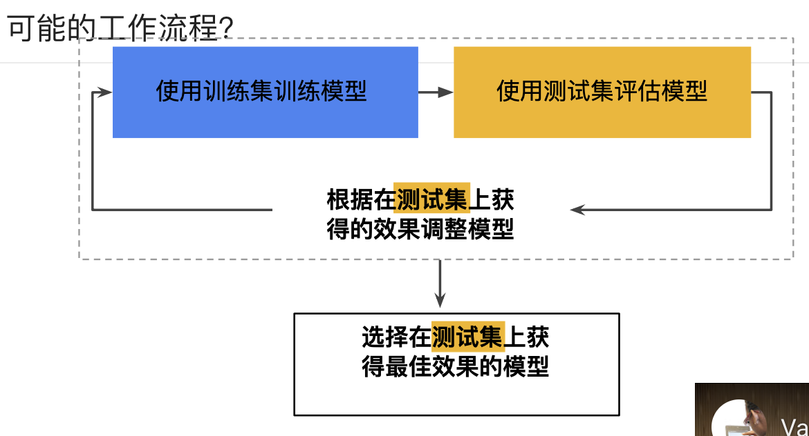
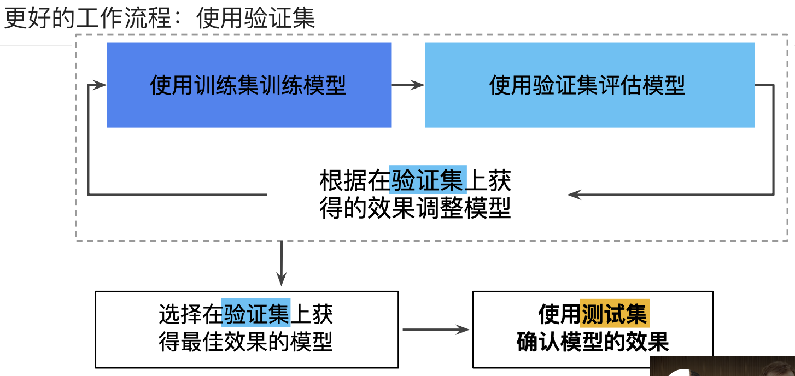

> 学习目标：
>
> - 了解验证集在数据集划分中的重要性

## 另一个划分

之前我们讲到了把数据集分为训练集和测试集，考虑以下的工作流程。

**图1. 可能的工作流程？**

这样针对测试集的特性进行了过拟合。

### 划分新的数据集

**图2. 数据集的划分，增加验证集**

新的工作流程如下：

**图3. 更好的工作流程**

这样的流程之所以好，是因为它暴露给测试集更少的信息。

编程参看[validation.ipynb](../code/validation.ipynb)

