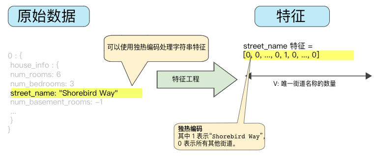

## 表示法(特征工程)

### 从原始数据映射到特征


图1. 将原始数据映射到机器学习的特征

#### 数值映射

整数和浮点数不需要特殊的编码


图2. 将整数值映射到浮点值是没有意义的

#### 字符串值映射

模型无法直接学习字符串值得规律，需要进行映射转换为数字形式：

1. 把要表示的所有特征的字符串值定义一个词汇表。
2. 用该词汇表创建**独热编码**，每个字符串值表示为二元矢量，即只有一个元素设为1，其它都是0.

矢量的长度等于词汇表的元素数。



图3. 独热编码映射的字符串值

#### 分类值映射

把分类特征编码为枚举类型表示不同值的整数离散集。

名为```lowland Countries``` 的特征包含三个可能的值：

{'Netherland', 'Belgium','Luxembourg'}，分别用0，1，2表示。

不过，机器学习模型通常将每个分类特征表示为单独的布尔值，x1：是荷兰吗？x2：是比利时吗？x3：是卢森堡吗？

### 良好特征的特点

- 避免很少使用的离散特征值

  良好的特征值应该出现大约5次以上。假如某个特征值仅出现一次或很少出现，模型就无法根据该特征进行预测，比如unique_house_id就不适合作为特征，因为每个值只出现一次。

- 最好具有清晰明确的含义

  比如，房龄

  ```yaml
  house_age: 27  # ✅清晰的含义
  
  house_age: 851472000  # ❌不可识别
  ```

- 不要混入奇异的值

  假如一个特征的范围是0到1之间的浮点值，但如果用户没有输入此特征值，数据集可能使用如-1这样奇异的值。

  **解决方法**：

  - 特征[1]只记录分数，不含奇异值。
  - 特征[2]存储布尔值，表示是否含有特征[1]

- 考虑上游的不稳定性

  特征的定义不应随时间发生变化。

  比如下列值是有用的：

  ```yaml
  city_id: "br/sao_paulo"  # ✅城市名字一般不会改变，也要转成独热矢量
  ```

  用数字编号代替：

  ```yaml
  inferred_city_cluster: "219"  # ❌这种表示在以后可能会轻易发生变化
  ```

### 数据清理

我们必须要明确这一点，即使是非常少量的坏样本，也可能会破坏掉一个大规模的数据集。

#### 缩放特征值

**缩放**是指将浮点特征值从自然范围(e.g. 100 to 900) 转换到标准范围(e.g. 0 to 1 or -1 to +1)，假如特征集只有一个特征，则缩放提供的实际好处微乎其微或没有。但是，如果特征集包含多个特征，缩放可以带来以下优势：

- 帮助梯度下降法更快速地收敛。
- 帮助避免“NaN”陷阱，这种陷阱把一个数值变成NaN(某个值在训练期间超出浮点数精确率限制)
- 帮助模型为每个特征确定适合的权重。

我们不用对每个特征进行相同尺度的缩放。特征[0]是从-1到+1，特征[2]是从-3到+3也是可以的。

- 一个显而易见的方法是以线性方式把[min,max]映射到较小的范围如：[-1,+1]

- 另一个常用的缩放策略是计算每个值的z-score（z得分）：
  $$scaledvalue = (value - mean)/stddev$$

   例如：
  - 均值 = 100
  - 标准偏差 = 20
  - 原始值 = 130
  则：
  scaled_value = (130 - 100) / 20 = 1.5
  意味着大多数缩放后的值将介于-3 到 +3之间，少量值会略高于或略低于该范围。

#### 处理极端离群值

针对加州住房数据集，我们通过计算人均房屋数增加了一个额外的人工特征```roomsPerPerson```,如图：


图4. 很长的尾巴

可以发现该特征有一些离群的值，我们用最大限度的降低这些值带来的影响

##### 对数缩放


图5. 对数缩放后仍然有较长的尾巴，但对数缩放可以稍微缓解极端离群值带来的影响

##### 限制特征值大小


图6. 把特征值限制到4.0，意味着大于4.0的值都将赋值为4.0，以致出现了那一处伪影。

#### 分箱


图7. 每个纬度的房屋署

在数据集中，latitude是一个浮点值。但在我们的模型中，把它表示成浮点特征是没有意义的，这是因为纬度与房价之间不存在线性关系。

为了把纬度变为一项实用的预测指标，我们对纬度进行“分箱”，如图8所示：


图8. 分箱，分为了11部分

我们现在就拥有了11个不同的布尔值特征，(LatitudeBin1,LatitudeBin2,...,LatitudeBin11)

可以将纬度37.4表示为：

```[0, 0, 0, 0, 0, 1, 0, 0, 0, 0, 0]```

分箱之后，模型就可以为每个纬度学习完全不同的权重。

**分箱方法**：

- 整数或更精细的方案

- 按分位数分箱,保证每个桶里的样本数量是相等的。

  > **分位数**（英语：Quantile），亦称**分位点**，是指用分割点（cut point）将一个随机变量的概率分布范围分为几个具有相同概率的连续区间。分割点的数量比划分出的区间少1，例如3个分割点能分出4个区间。
  >
  > 常用的有中位数（即二分位数）、四分位数（quartile）、十分位数（decile ）、百分位数等。q-quantile是指将有限值集分为q个接近相同尺寸的子集。

#### 清查

在现实生活中，数据集中有很多样本是不可靠的，问题可能有如下：

- **遗漏**：有人忘记输入某个样本的某个特征值
- **重复**：同一条记录上传了两次
- **不良标签**：有人错误的标记了错误的标签
- **不良特征值**：有人错误输入了数据

一旦出现上述问题，我们通常需要把相应的样本从数据集中移除，从而修正不良样本。

遗漏值和重复样本容易检测，要检测不良样本和不良特征值比较棘手，一般可以使用统计信息来可视化(如：**直方图**)数据来发现，以下统计信息也比较有用：

- 最大值和最小值
- 均值和中间值
- 标准偏差

#### 了解数据

遵循以下规则：

- 记住预期的数据状态
- 确认数据是否满足这些预期
- 仔细检查训练数据是否和其他来源的数据一致

谨慎处理数据，**良好的机器学习模型依赖于良好的数据**。

编程参见: [feature_sets.ipynb](./featrue_sets.ipynb)