# 第0节 前提准备(Preparing)

## 0.1. Pandas 使用入门

机器学习速成课程中的编程练习使用 [Pandas](http://pandas.pydata.org/) 库来操控数据集。如果您不熟悉 Pandas，建议您先学习[Pandas 简介](https://colab.research.google.com/notebooks/mlcc/intro_to_pandas.ipynb?utm_source=mlcc&utm_campaign=colab-external&utm_medium=referral&utm_content=pandas-colab&hl=zh-cn)教程，该教程介绍了练习中使用的主要 Pandas 功能。编程参看[hello_pandas.ipynb](./hello_pandas.ipynb)

## 0.2. 低阶 TensorFlow 基础知识

机器学习速成课程中的编程练习使用 TensorFlow 的高阶 [tf.estimator API](https://www.tensorflow.org/api_docs/python/tf/estimator/Estimator) 来配置模型。如果您有兴趣从头开始构建 TensorFlow 模型，请学习以下教程：

- [TensorFlow Hello World](https://colab.research.google.com/notebooks/mlcc/hello_world.ipynb?utm_source=mlcc&utm_campaign=colab-external&utm_medium=referral&utm_content=helloworld-colab&hl=zh-cn)：在低阶 TensorFlow 中编码的“Hello World”。编程参看[hello_tf.ipynb](../code/hello_tf.ipynb)
- [TensorFlow 编程概念](https://colab.research.google.com/notebooks/mlcc/tensorflow_programming_concepts.ipynb?utm_source=mlcc&utm_campaign=colab-external&utm_medium=referral&utm_content=tfprogconcepts-colab&hl=zh-cn)：演示了 TensorFlow 应用中的基本组件：张量、指令、图和会话。
- [创建和操控张量](https://colab.research.google.com/notebooks/mlcc/creating_and_manipulating_tensors.ipynb?utm_source=mlcc&utm_campaign=colab-external&utm_medium=referral&utm_content=tensors-colab&hl=zh-cn)：张量快速入门 - TensorFlow 编程中的核心概念。此外，还回顾了线性代数中的矩阵加法和乘法概念。编程参看[tensors_in_tf.ipynb](../code/tensors_in_tf.ipynb)

## 0.3. 主要概念和工具

机器学习速成课程中介绍并应用了以下概念和工具。有关详情，请参阅链接的资源。

### 0.3.1. 数学

#### 代数

- [变量](https://www.khanacademy.org/math/algebra/introduction-to-algebra/alg1-intro-to-variables/v/what-is-a-variable)、[系数](https://www.khanacademy.org/math/cc-sixth-grade-math/cc-6th-equivalent-exp/cc-6th-parts-of-expressions/v/expression-terms-factors-and-coefficients)和[函数](https://www.khanacademy.org/math/algebra/algebra-functions)
- [线性方程式](https://wikipedia.org/wiki/Linear_equation)，例如 y=b+w1x1+w2x2
- [对数](https://wikipedia.org/wiki/Logarithm)和对数方程式，例如 y=ln(1+ez)
- [S 型函数](https://wikipedia.org/wiki/Sigmoid_function)

#### 线性代数

- [张量和张量等级](https://www.tensorflow.org/programmers_guide/tensors)
- [矩阵乘法](https://wikipedia.org/wiki/Matrix_multiplication)

#### 三角学

- [Tanh](https://reference.wolfram.com/language/ref/Tanh.html)（作为[激活函数](https://developers.google.com/machine-learning/glossary#activation_function)进行讲解，无需提前掌握相关知识）

#### 统计信息

- [均值、中间值、离群值](https://www.khanacademy.org/math/probability/data-distributions-a1/summarizing-center-distributions/v/mean-median-and-mode)和[标准偏差](https://wikipedia.org/wiki/Standard_deviation)
- 能够读懂[直方图](https://wikipedia.org/wiki/Histogram)

#### 微积分（可选，适合高级主题）

- [导数](https://wikipedia.org/wiki/Derivative)概念（您不必真正计算导数）
- [梯度](https://www.khanacademy.org/math/multivariable-calculus/multivariable-derivatives/gradient-and-directional-derivatives/v/gradient)或斜率
- [偏导数](https://wikipedia.org/wiki/Partial_derivative)（与梯度紧密相关）
- [链式法则](https://wikipedia.org/wiki/Chain_rule)（带您全面了解用于训练神经网络的[反向传播算法](https://developers.google.com/machine-learning/crash-course/backprop-scroll/)）

## 0.4. Python 编程

### 0.4.1. 基础 Python

[Python 教程](https://docs.python.org/3/tutorial/)中介绍了以下 Python 基础知识：

- [定义和调用函数](https://docs.python.org/3/tutorial/controlflow.html#defining-functions)：使用位置和[关键字](https://docs.python.org/3/tutorial/controlflow.html#keyword-arguments)参数
- [字典](https://docs.python.org/3/tutorial/datastructures.html#dictionaries)、[列表](https://docs.python.org/3/tutorial/introduction.html#lists)、[集合](https://docs.python.org/3/tutorial/datastructures.html#sets)（创建、访问和迭代）
- [`for` 循环](https://docs.python.org/3/tutorial/controlflow.html#for-statements)：包含多个迭代器变量的 `for` 循环（例如 `for a, b in [(1,2), (3,4)]`）
- [`if/else` 条件块](https://docs.python.org/3/tutorial/controlflow.html#if-statements)和[条件表达式](https://docs.python.org/2.5/whatsnew/pep-308.html)
- [字符串格式](https://docs.python.org/3/tutorial/inputoutput.html#old-string-formatting)（例如 `'%.2f' % 3.14`）
- 变量、赋值、[基本数据类型](https://docs.python.org/3/tutorial/introduction.html#using-python-as-a-calculator)（`int`、`float`、`bool`、`str`）
- [`pass` 语句](https://docs.python.org/3/tutorial/controlflow.html#pass-statements)

### 0.4.2. 中级 Python

[Python 教程](https://docs.python.org/3/tutorial/)还介绍了以下更高级的 Python 功能：

- [列表推导式](https://docs.python.org/3/tutorial/datastructures.html#list-comprehensions)
- [Lambda 函数](https://docs.python.org/3/tutorial/controlflow.html#lambda-expressions)

## 0.5. 第三方 Python 库

机器学习速成课程代码示例使用了第三方库提供的以下功能。无需提前熟悉这些库；您可以在需要时查询相关内容。

### 0.5.1. [Matplotlib](http://matplotlib.org/contents.html)（适合数据可视化）

- [`pyplot`](http://matplotlib.org/api/pyplot_api.html) 模块
- [`cm`](http://matplotlib.org/api/cm_api.html) 模块
- [`gridspec`](http://matplotlib.org/api/gridspec_api.html) 模块

### 0.5.2. [Seaborn](http://seaborn.pydata.org/index.html)（适合热图）

- [`heatmap`](http://seaborn.pydata.org/generated/seaborn.heatmap.html) 函数

### 0.5.3. [Pandas](http://pandas.pydata.org/)（适合数据处理）

- [`DataFrame`](http://pandas.pydata.org/pandas-docs/stable/dsintro.html#dataframe) 类

### 0.5.4. [NumPy](http://www.numpy.org/)（适合低阶数学运算）

- [`linspace`](https://docs.scipy.org/doc/numpy-1.10.0/reference/generated/numpy.linspace.html) 函数
- [`random`](https://docs.scipy.org/doc/numpy/reference/generated/numpy.random.random.html#numpy.random.random) 函数
- [`array`](https://docs.scipy.org/doc/numpy/reference/generated/numpy.array.html) 函数
- [`arange`](https://docs.scipy.org/doc/numpy/reference/generated/numpy.arange.html) 函数

### 0.5.5. [scikit-learn](http://scikit-learn.org/)（适合评估指标）

- [metrics](http://scikit-learn.org/stable/modules/classes.html#module-sklearn.metrics) 模块

## 0.6. Bash 终端/云端控制台

要在本地计算机上或云端控制台中运行编程练习，您应该能熟练使用命令行：

- [Bash 参考手册](https://tiswww.case.edu/php/chet/bash/bashref.html)
- [Bash 快速参考表](https://github.com/LeCoupa/awesome-cheatsheets/blob/master/languages/bash.sh)
- [了解 Shell](http://www.learnshell.org/)


<div style="page-break-after: always;"></div>
> 学习目标：
>
> - 复习机器学习基本术语
> - 了解机器学习各种用途

# 第1节 问题构建(Framing)

监督机器学习可简单定义如下：
- 机器学习系统通过学习如何组合输入信息来对从未见过的数据做出有用的预测。

## 1.1. 基本术语

### 1.1.1. 标签(label)

**标签**是要预测的事物，简单线性回归中的 y 变量。
> 标签可以是小麦未来的价格、图片中显示的动物品种、音频剪辑的含义或任何事物。

### 1.1.2. 特征(features)

**特征**是输入变量，即简单线性回归中的 x 变量。
> 简单的机器学习项目可能会使用单个特征，而比较复杂的机器学习项目可能会使用数百万个特征，按如下方式指定：
$$\{x_1,x_2,\dots,x_N\}$$

### 1.1.3. 样本(example)

**样本**是指数据的特定实例，**x**，分为：
  - 有标签样本
  - 无标签样本

**有标签样本**包含特征和标签。以加州房价数据集为例。

| housingMedianAge<br>（特征） | totalRooms<br>（特征）| totalBedrooms<br>（特征） | medianHouseValue<br>（标签）|
| :--- | :--- | :--- | :--- |
|15 |	5612 |	1283 |	66900 |
|19 |	7650 |	1901 |	80100 |
|17 |	720  |	174 |	85700 |
|14 |	1501 |	337 |	73400 |
|20 |	1454 |	326 |	65500 |

**无标签样本**包含特征但不包含标签。
> 无标签样本可以是新的待估价的住房信息

### 1.1.4. 模型(model)

模型定义了特征与标签之间的关系。
 - **训练**表示创建或学习模型。
 - **推断**表示将训练后的模型应用于无标签样本。

### 1.1.5. 回归与分类(Regression and Classification)

**回归**模型可以预测连续值。如：
 - 加利福尼亚州一栋房产的价值是多少？
 - 用户点击此广告的概率是多少？

**分类**模型可以预测离散值。如：
- 垃圾邮件还是非垃圾邮件？
- 一张图片是热狗还是不是热狗？


<div style="page-break-after: always;"></div>
> 学习目标：
>
> - 复习直线拟合知识
> - 机器学习中的权重和偏差和直线拟合中的斜率和偏移联系起来
> - 大致了解损失(Loss)，详细了解平方损失(Squared Error)
> - 了解如何使用迭代方法来训练模型
> - 全面了解梯度下降法和一些变体如(小批量梯度下降，随机梯度下降)
> - 尝试不同的学习速率

# 第2节 深入了解机器学习(Descending into Machine Learning)

## 2.1. 线性回归(Linear Regression)

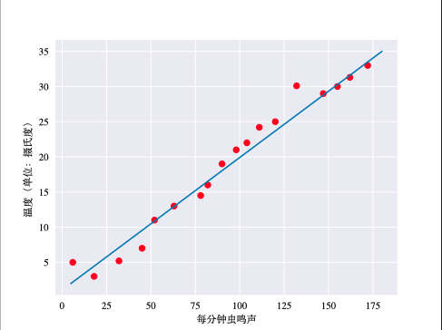
鸣叫声和温度的关系可以描述如下：
$$y=mx+b$$

 - $y$指的是温度（以摄氏度表示），即我们试图预测的值。
 - $m$指的是直线的斜率.
 - $x$指的是每分钟的鸣叫声次数，即输入特征的值。
 - $b$指的是 y 轴截距

写作机器学习中常见的形式：
$$y'=b+w_1x_1$$
 - $y'$指的是预测标签。
 - $b$指的是偏差，也被称为$w_0$.
 - $w_1$是特征1的权重
 - $x_1$是指特征1

假如模型包含多个特征：
$$y'=b+w_1x_1+w_2x_2+w_3x_3$$

## 2.2. 训练与损失(Training and Loss)

**平方损失**，又称L2损失
$$Loss2=(y-y')^2$$

**均方误差**指的是每个样本的平均平方损失。
$$MSE=\frac{1}{N}\sum_{(x,y)\in{D}}{(y-prediction(x))^2}$$

 - $(x,y)$指的是样本，$x$是特征集，$y$是相应的标签。
 - $prediction(x)$指的是集合了权重、特征、偏差的函数
 - $D$指的是包含多个有标签样本的数据集
 - $N$指的$D$中的样本数量

## 2.3. 降低损失(Reducing Loss)

### 2.3.1. 如何降低损失？

**平方损失**相对于权重和偏差的导数可以展现损失的变化情况。

 - 易于计算且为凸形。
 - 在降低损失的方向上移动小步（负梯度方向），小步被称为**梯度步长**，这种优化策略称为**梯度下降法**。

### 2.3.2. 梯度下降示意 

迭代方法。

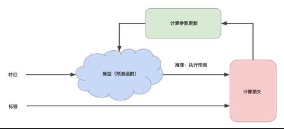

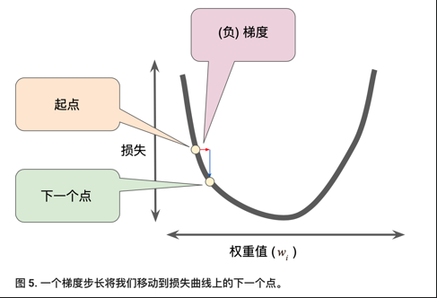

### 2.3.3. 权重初始化

对于凸形问题(碗的形状)，权重可以从任意位置开始，（如：全为0）
  - 只有一个最低点(minimum),可以达到全局最优
注意，不适用于神经网络
  - 非凸
  - 多个最低点
  - 很大程度依赖初始值

### 2.3.4. SGD和Batch-GD

  - 可以每步都计算整个数据集的梯度，但事实不需要这样做。
  - 计算小型数据样本的梯度效果很好
  - 每一步抽取一个新的随机样本
  - 随机梯度下降法：一次抽取一个样本
  - 小批量梯度下降：每批次包含10-1000个样本
  - 损失和梯度在整批范围内达到平衡

 实践中往往采用折中的方法，Batch-SGD。

### 2.3.5. 学习速率

每个回归问题都存在一个Goldilocks的学习速率，如果梯度较小，可以用较大的学习速率来补偿较小的梯度获得更大的步长。


<div style="page-break-after: always;"></div>
> 学习目标：
>
> - TensorFlow和Pandas的一些基本操作
> - 使用TensorFlow高级API

# 第3节 使用TensorFlow工具包

## 3.1. 层次结构
- 层次结构

  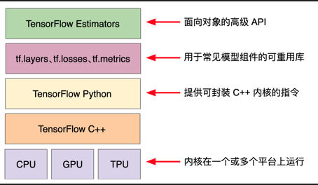
  **图 1. TensorFlow 工具包层次结构。**

| 工具包                         | 说明                   |
| ------------------------------ | ---------------------- |
| Estimator (tf.estimator)       | 高级 OOP API。         |
| tf.layers/tf.losses/tf.metrics | 用于常见模型组件的库。 |
| TensorFlow                     | 低级 API               |


- TF由下面两个组件组成
  - 图协议缓冲区
  - 执行图的运行时
  > 这两个组件类似于Java编译器和JVM


## 3.2. tf.estimator API

```tf.estimator```与scikit-learn API兼容。

```python
import tensorflow as tf

# Set up a linear classifier.
classifier = tf.estimator.LinearClassifier()

# Train the model on some example data.
classifier.train(input_fn=train_input_fn, steps=2000)

# Use it to predict.
predictions = classifier.predict(input_fn=predict_input_fn)
```


编程参看[first_step_with_tensorflow.ipynb](../code/first_step_with_tensorflow.ipynb)


<div style="page-break-after: always;"></div>
> 学习目标：
>
> - 理解什么是过拟合
> - 判定一个模型是否出色，数据集的划分

# 第4节 泛化(Generalization)

## 4.1. 过拟合的风险 

导致模型在训练集上损失很低，但是在新数据上的预测能力很糟糕。 

机器学习要适合地拟合我们的数据，但也要尽可能简单的拟合数据。遵循：**奥卡姆剃刀定律**。 

> 一个机器学习模型越简单，一个良好的经验结果就不只是由于样本的特性而得到的。 

现在，奥卡姆剃刀定律正式应用于统计学习理论和计算学习理论领域，这些领域已经形成了泛化边界，统计化地描述模型根据以下因素泛化到新数据的能力： 

- 模型的复杂程度 

- 模型在处理训练数据时的表现 

数据集应按照一定比例分为训练集、（验证集）、测试集。 

- 训练集 - 用于训练模型的子集。
- 测试集 - 用于测试模型的子集。
 
一般来说，在测试集上表现是否良好是衡量能否在新数据上表现良好的有用指标，前提是：

- 测试集足够大。
- 您不会反复使用相同的测试集来作假。

## 4.2. 机器学习细则 

- 从分布中抽取独立同分布(i.i.d)样本。 

- 分布是平稳的。 

- 我们从同一分布的数据划分中抽取样本。 

有时可能会违背以上三个原则，任何一项被违背，我们就必须密切注意指标。 

## 4.3. 数据集 

- 训练集规模越大，模型的学习效果越好、 

- 测试集规模越大，我们对于评估指标的信心就越充足，置信区间就越窄。 

一定不要对测试数据进行训练 


<div style="page-break-after: always;"></div>
> 学习目标：
>
> - 了解验证集在数据集划分中的重要性

# 第5节 验证(Validation)

## 5.1. 另一个划分

之前我们讲到了把数据集分为训练集和测试集，考虑以下的工作流程。

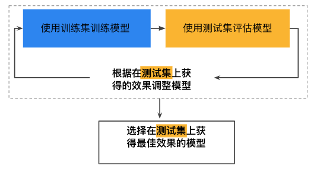

**图1. 可能的工作流程？**

这样针对测试集的特性进行了过拟合。

## 5.2. 划分新的数据集


**图2. 数据集的划分，增加验证集**

新的工作流程如下：


**图3. 更好的工作流程**

这样的流程之所以好，是因为它暴露给测试集更少的信息。

编程参看[validation.ipynb](../code/validation.ipynb)


<div style="page-break-after: always;"></div>
> 学习目标：
>
> - 将日志中的字段映射到实用的机器学习特征
> - 判断哪些数据特性适合作为学习特征
> - 处理离群值特征
> - 数据集统计属性
> - 使用tf.estimator训练评估模型

# 第6节 表示法(Representation)

## 6.1. 特征工程

### 6.1.1 从原始数据映射到特征

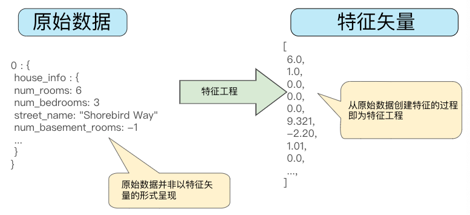

图1. 将原始数据映射到机器学习的特征

#### 数值映射

整数和浮点数不需要特殊的编码


图2. 将整数值映射到浮点值是没有意义的

#### 字符串值映射

模型无法直接学习字符串值得规律，需要进行映射转换为数字形式：

1. 把要表示的所有特征的字符串值定义一个词汇表。
2. 用该词汇表创建**独热编码**，每个字符串值表示为二元矢量，即只有一个元素设为1，其它都是0.

矢量的长度等于词汇表的元素数。

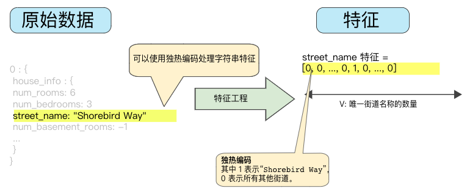

图3. 独热编码映射的字符串值

#### 分类值映射

把分类特征编码为枚举类型表示不同值的整数离散集。

名为```lowland Countries``` 的特征包含三个可能的值：

{'Netherland', 'Belgium','Luxembourg'}，分别用0，1，2表示。

不过，机器学习模型通常将每个分类特征表示为单独的布尔值，x1：是荷兰吗？x2：是比利时吗？x3：是卢森堡吗？

## 6.2. 良好特征的特点

- 避免很少使用的离散特征值

  良好的特征值应该出现大约5次以上。假如某个特征值仅出现一次或很少出现，模型就无法根据该特征进行预测，比如unique_house_id就不适合作为特征，因为每个值只出现一次。

- 最好具有清晰明确的含义

  比如，房龄

  ```yaml
  house_age: 27  # 清晰的含义
  
  house_age: 851472000  # 不可识别
  ```

- 不要混入奇异的值

  假如一个特征的范围是0到1之间的浮点值，但如果用户没有输入此特征值，数据集可能使用如-1这样奇异的值。

  **解决方法**：

  - 特征[1]只记录分数，不含奇异值。
  - 特征[2]存储布尔值，表示是否含有特征[1]

- 考虑上游的不稳定性

  特征的定义不应随时间发生变化。

  比如下列值是有用的：

  ```yaml
  city_id: "br/sao_paulo"  # 城市名字一般不会改变，也要转成独热矢量
  ```

  用数字编号代替：

  ```yaml
  inferred_city_cluster: "219"  # 这种表示在以后可能会轻易发生变化
  ```

## 6.3. 数据清理

我们必须要明确这一点，即使是非常少量的坏样本，也可能会破坏掉一个大规模的数据集。

### 6.3.1. 缩放特征值

**缩放**是指将浮点特征值从自然范围(e.g. 100 to 900) 转换到标准范围(e.g. 0 to 1 or -1 to +1)，假如特征集只有一个特征，则缩放提供的实际好处微乎其微或没有。但是，如果特征集包含多个特征，缩放可以带来以下优势：

- 帮助梯度下降法更快速地收敛。
- 帮助避免“NaN”陷阱，这种陷阱把一个数值变成NaN(某个值在训练期间超出浮点数精确率限制)
- 帮助模型为每个特征确定适合的权重。

我们不用对每个特征进行相同尺度的缩放。特征[0]是从-1到+1，特征[2]是从-3到+3也是可以的。

- 一个显而易见的方法是以线性方式把[min,max]映射到较小的范围如：[-1,+1]

- 另一个常用的缩放策略是计算每个值的z-score（z得分）：
  $$scaledvalue = (value - mean)/stddev$$

   例如：
  - 均值 = 100
  - 标准偏差 = 20
  - 原始值 = 130
  则：
  scaled_value = (130 - 100) / 20 = 1.5
  意味着大多数缩放后的值将介于-3 到 +3之间，少量值会略高于或略低于该范围。

### 6.3.2. 处理极端离群值

针对加州住房数据集，我们通过计算人均房屋数增加了一个额外的人工特征```roomsPerPerson```,如图：

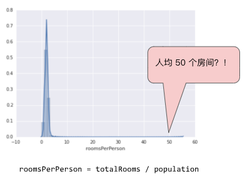

图4. 很长的尾巴

可以发现该特征有一些离群的值，我们应该最大限度地降低这些值带来的影响

#### 对数缩放

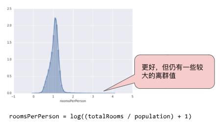

图5. 对数缩放后仍然有较长的尾巴，但对数缩放可以稍微缓解极端离群值带来的影响

#### 限制特征值大小


图6. 把特征值限制到4.0，意味着大于4.0的值都将赋值为4.0，以致出现了那一处伪影。

### 6.3.3. 分箱

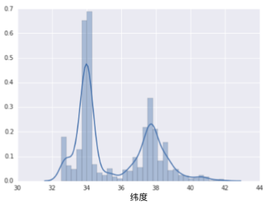

图7. 每个纬度的房屋署

在数据集中，latitude是一个浮点值。但在我们的模型中，把它表示成浮点特征是没有意义的，这是因为纬度与房价之间不存在线性关系。

为了把纬度变为一项实用的预测指标，我们对纬度进行“分箱”，如图8所示：

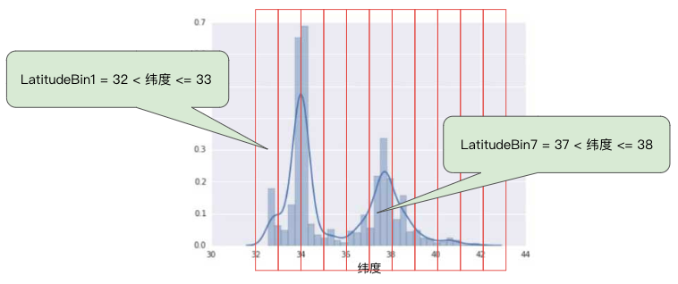

图8. 分箱，分为了11部分

我们现在就拥有了11个不同的布尔值特征，(LatitudeBin1,LatitudeBin2,...,LatitudeBin11)

可以将纬度37.4表示为：

```[0, 0, 0, 0, 0, 1, 0, 0, 0, 0, 0]```

分箱之后，模型就可以为每个纬度学习完全不同的权重。

**分箱方法**：

- 整数或更精细的方案

- 按分位数分箱,保证每个桶里的样本数量是相等的。

  > **分位数**（英语：Quantile），亦称**分位点**，是指用分割点（cut point）将一个随机变量的概率分布范围分为几个具有相同概率的连续区间。分割点的数量比划分出的区间少1，例如3个分割点能分出4个区间。
  >
  > 常用的有中位数（即二分位数）、四分位数（quartile）、十分位数（decile ）、百分位数等。q-quantile是指将有限值集分为q个接近相同尺寸的子集。

### 6.3.4. 清查

在现实生活中，数据集中有很多样本是不可靠的，问题可能有如下：

- **遗漏**：有人忘记输入某个样本的某个特征值
- **重复**：同一条记录上传了两次
- **不良标签**：有人错误的标记了错误的标签
- **不良特征值**：有人错误输入了数据

一旦出现上述问题，我们通常需要把相应的样本从数据集中移除，从而修正不良样本。

遗漏值和重复样本容易检测，要检测不良样本和不良特征值比较棘手，一般可以使用统计信息来可视化(如：**直方图**)数据来发现，以下统计信息也比较有用：

- 最大值和最小值
- 均值和中间值
- 标准偏差

### 6.3.5. 了解数据

遵循以下规则：

- 记住预期的数据状态
- 确认数据是否满足这些预期
- 仔细检查训练数据是否和其他来源的数据一致

谨慎处理数据，**良好的机器学习模型依赖于良好的数据**。

编程参见: [feature_sets.ipynb](../code/feature_sets.ipynb)


<div style="page-break-after: always;"></div>
> 学习目标：
>
> - 了解什么是特征组合
> - 在TensorFlow中实践特征组合

# 第7节 特征组合(Feature Crosses)

## 7.1. 对非线性规律进行编码


**图1. 这是线性问题，我们可以用一条线很好地做出预测**

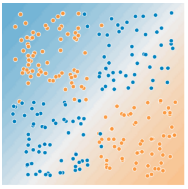

**图2. 非线性问题，不能用一条线将两种类型的数据分开**

为了解决图2的非线性问题，可以创建一个特征组合。**特征组合**是指通过将两个或多个输入特征相乘来对特征空间中的非线性规律进行编码的合成特征。“cross”(组合)这一术语来自cross product(向量积)。比如，利用$x_1$和$x_2$两个特征组合得到：$$x_3=x_1x_2$$

线性公式变为：

$$y=b+w_1x_1+w_2x_2+w_3x_3$$

## 7.2. 特征组合的种类

我们可以创建很多不同种类的特征组合：

- [A x B]
- [A x B x C x D x E]
- [A x A]

通过随机梯度下降法可以有效地训练线性模型，在使用扩展的线性模型时，辅以特征组合一直都是训练大规模数据集的有效方法。

## 7.3. 组合独热矢量

前面我们已经知道如何组合两个单独的浮点数特征。实践中，机器学习模型很少会组合连续特征，但是常常**组合独热特征矢量**，将独热特征矢量的特征组合视为逻辑连接。

比如我们将用到的*加州房价数据集*中的经度和纬度信息进行分箱，分别获得5元素特征矢量。

```python
binned_latitude = [0, 0, 0, 1, 0]
binned_longitude = [0, 1, 0, 0, 0]
```

对两个特征矢量创建特征组合：

```python
binned_latitude x binned_longitude
```

我们将得到25个元素的独热矢量。

## 7.4. 为什么要特征组合?

- 线性学习器可以很好地扩展到大量数据，但如果不使用特征组合，这些模型的表现会受到限制。
- 使用特征组合+大量数据是学习高度复杂模型的一种有效策略
  - （神经网络可提供另一种策略）

编程参见：[feature_crosses.ipynb](../code/feature_crosses.ipynb)


<div style="page-break-after: always;"></div>
> 学习目标：
>
> - 了解模型复杂度和泛化之间的权衡
> - 使用L2正则化进行实验

# 第8节 简化正则化

## 8.1. L2正则化

如下**泛化曲线**，显示了训练集和验证集相对于迭代次数的损失。


**图1. 训练集和验证集损失**

该泛化曲线表明模型与训练集中的数据过拟合。根据奥卡姆剃刀原则，我们可以通过降低模型的复杂度来避免过拟合，这种原则叫正则化。

我们的模型并非只以最小化损失(**经验风险最小化**)为目标：

$$minimize(Loss(Data|Model))$$

而是以最小化损失和复杂度为共同目标，称**结构风险最小化**：

$$minimize(Loss(Data|Model) + complexity(Model))$$

现在，我们的训练优化算法是由两部分组成的函数：

- 损失项：衡量模型与数据的拟合度
- 正则化项：衡量模型的复杂度，与数据无关

这里我们介绍两种衡量模型复杂度的方式：

- 模型中**所有特征的权重**的函数（特征权重的绝对值越高，对模型复杂度的贡献越大）


- 具有**非零权重的特征总数**的函数

我们可以使用$L_2$正则化公式来量化复杂度，该公式正则化项定义为所有特征权重的平方和：

$$L_2\ regularization\ term = ||w||_2^2=w_1^2+w_2^2+\dots+w_n^2$$

在这个公式中，接近于0的权重对模型的复杂度几乎没有影响，而离群值权重则可能产生巨大的影响。(平方所带来的影响)

## 8.2. Lambda

我们通过改变**Lambda**值来调整正则化项对模型的整体影响，这里的Lambda称作：**正则化率**（越高会增强正则化效果）

$$minimize(Loss(Data|Model)+\lambda\ complexity(Model))$$

执行$L_2$正则化对模型具有以下影响

- 使权重值接近于0
- 使权重值平均值接近于0，且呈正态分布

我们在选择lambda值的时候，我们的目的是在简单化和训练数据拟合之间达到适合的平衡：

- Lambda值过高，模型会很简单，存在模型对数据**欠拟合**的风险。
- Lambda值过低，模型会很复杂，存在模型对数据**过拟合**的风险。
- Lambda值设为0，模型训练的唯一目的就是将经验风险最小化，而过拟合的风险达到最高。

> 常常我们需要自己根据数据情况去选择一个理想的Lambda的值。

## 8.3. 学习速率和L2正则化的关系

它们之间存在密切的关系。墙L2正则化值往往会使特征权重更接近于0，而较低的学习速率(使用**早停法**)通常会产生相同的效果，同时调整两者可能会令人混淆。

**早停法**指的是在模型完全收敛之前就结束训练。我们常常在以在线方式进行训练时采取一些隐式早停法。

为了消除这种混淆，一种有用的做法是，在训练一批固定的数据时执行足够多次迭代，这样早停法就不会起作用。


## 8.4. 问答

Q：假设某个线性模型具有 100 个输入特征：

其中 10 个特征信息丰富。

另外 90 个特征信息比较缺乏。

假设所有特征的值均介于 -1 和 1 之间。 以下哪些陈述属实？

A：

- L2 正则化可能会导致对于某些**信息缺乏**的特征，模型会学到适中的权重。

  > 出乎意料的是，当某个信息缺乏的特征正好与标签相关时，便可能会出现这种情况。在这种情况下，模型会将本应给予信息丰富的特征的部分“积分”错误地给予此类信息缺乏的特征。


- L2 正则化会使很多信息缺乏的权重接近于（但并非正好是）0.0。

  > L2 正则化会使权重接近于 0.0，但并非正好为 0.0。

- L2 正则化会使大多数信息缺乏的权重正好为 0.0。

  > L2 正则化不会倾向于使权重正好为 0.0。L2 正则化降低较大权重的程度高于降低较小权重的程度。随着权重越来越接近于 0.0，L2将权重“推”向 0.0 的力度越来越弱。


<div style="page-break-after: always;"></div>
> 学习目标：
>
> - 了解逻辑回归
> - 了解逻辑回归的损失和正则化函数

# 第9节 逻辑回归(Logistic Regression)

## 9.1. 计算概率

许多问题需要将概率估算值作为输出。**逻辑回归**是一种及其高效的概率计算机制。实际上，我们可以使用以下两种方式之一使用返回的概率：

- 保持原样

  **例子**：假设我们创建的一个逻辑回归模型预测了狗在半夜发出叫声的概率:

  $p(bark|night) = 0.05$ , 则在一年时间内，狗叫的次数约为$N_{bark} = p(bark|night)*N_{nights}=0.05 * 365\approx 18$ (次)

- 转换为二元类别

  **例子**：在很多情况下，我们会把逻辑回归的结果映射到二元分类问题上，比如预测邮件是「垃圾邮件」还是「非垃圾邮件」。

**Sigmoid函数**具有把输入值映射到0-1之间的特征，其定义为：$y=\frac{1}{1+e^{-z}}$

它会产生如下曲线:

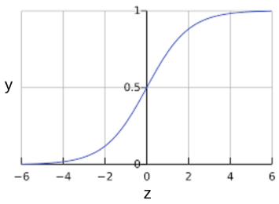

**图1. Sigmoid函数**(S型函数)

我们用$z$表示逻辑回归模型的线性层输出，则S(z)函数会生成一个介于0-1之间的概率，表示为：

$$y'=\frac{1}{1+e^{(-z)}}$$

其中：

- $y'$是逻辑回归模型针对特定样本的输出

- $z$是$w_0+w_1x_1+w_2x_2+\dots+w_nx_n$

  - $w$是模型学习的权重和偏差
  - $x$是数据样本的特征值

  > 注意：这里的$z$也被称为对数几率，$z$可以定义为标签"1"和标签"0"的概率比值的对数：
  >
  > $$z=log(\frac{1}{1-y})$$

## 9.2. 模型训练

### 9.2.1. 损失函数

线性回归的损失函数是平方损失函数，逻辑回归的损失函数是**对数损失函数**，定义为：

$$LogLoss = \sum_{(x,y)\in D}{-ylog(y')-(1-y)log(1-y')}$$

其中：

- $(x,y)\in D$是包含很多有样本标签(x,y)的数据集。
- $y$是样本的标签，逻辑回归中必须是0或者1
- $y'$是对特征集x的预测值，介于0-1之间

可以发现，对数损失函数的方程式和香农信息论中的熵测量有密切的关系。它也是似然函数的负对数（假设y属于伯努利分布). 实际上，最大限度地降低损失函数的值会生成最大的似然估计值。

## 9.3. 正则化

正则化在逻辑回归建模中及其重要。如果没有正则化，逻辑回归的**渐进性**会不断促使损失在高维空间内达到0，所以大多数逻辑回归模型会使用以下策略之一来降低模型复杂性：

- L2正则化
- 早停法，限制训练步数或学习速率。

> 假设我们向每个样本分配一个唯一 ID，且把每个 ID 映射到其自己的特征。如果未指定正则化函数，模型会变得完全过拟合。这是因为模型会尝试促使所有样本的损失达到 0 但始终达不到，从而使每个指示器特征的权重接近正无穷或负无穷。当有大量罕见的特征组合且每个样本中仅一个时，包含特征组合的高维度数据会出现这种情况。

## 9.4. 总结

- 逻辑回归模型会生成概率
- 逻辑回归的损失函数是对数损失
- 逻辑回归模型被业界广泛使用


<div style="page-break-after: always;"></div>
> 学习目标：
>
> - 评估逻辑回归模型的准确率和精确率
> - 了解ROC曲线和曲线下的面积

# 第10节 分类(Classification)

## 10.1. 阈值(threshold)

逻辑回归返回的是概率。我们可以「原样」使用输出的概率，也可以把输出的值转换成二元值。

假如我们的模型判定一封电子邮件是垃圾邮件的概率是0.6，我们应该怎样为其分类呢？

为了将逻辑回归值映射到二元类别，我们必须设置一个分类阈值(也叫判定阈值)。如果值高于阈值，则表示是「垃圾邮件」；反之不是。阈值取决于具体的问题，并不总是0.5。

## 10.2. 真假正负类

我们以「伊索寓言：狼来了」的故事作为背景：

> **伊索寓言：狼来了（精简版）**
>
> 有一位牧童要照看镇上的羊群，但是他开始厌烦这份工作。为了找点乐子，他大喊道：“狼来了！”其实根本一头狼也没有出现。村民们迅速跑来保护羊群，但他们发现这个牧童是在开玩笑后非常生气。
>
> [这样的情形重复出现了很多次。]
>
> 一天晚上，牧童看到真的有一头狼靠近羊群，他大声喊道：“狼来了！”村民们不想再被他捉弄，都待在家里不出来。这头饥饿的狼对羊群大开杀戒，美美饱餐了一顿。这下子，整个镇子都揭不开锅了。恐慌也随之而来。

针对故事，我们定义:

- 「狼来了」是正类别
- 「没有狼」是负类别

则故事中可能出现四种情况：

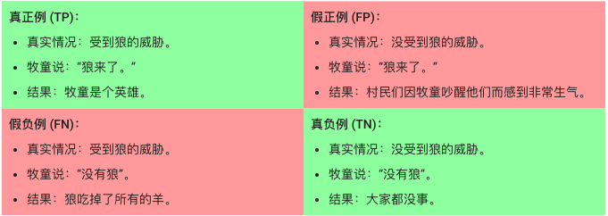

**真正例**是指模型将正类别样本正确地预测为正类别。同样，**真负例**是指模型将负类别样本正确地预测为负类别。

**假正例**是指模型将负类别样本错误地预测为正类别，而**假负例**是指模型将正类别样本错误地预测为负类别。

## 10.3. 准确率(Accuracy)

**准确率**是我们的模型预测正确的结果占总预测数的比例。

$$Accuracy = \frac{right predictions}{total predictions}$$

对于二元分类，准确率还可以表示如下：

$$Accuracy= \frac{TP+TN}{TP+TN+FP+FN}$$

我们来看一个例子:

> 我们训练了一个肿瘤分类的模型，恶性(**正类别**)，良性(**负类别**)：其中TP=1, FP=1, FN=8, TN=90，则根据上面公式可以得到：$准确率=0.91$。看上去准确率很高，我们的模型是个很好的模型，但可以发现其中FN有8个，总共9个恶性样本，预测错了8个，这是十分可怕的事情！

当我们在使用**分类不平衡的数据集**的时候，单一准确率并不能反映全面的情况。

## 10.4. 精准率和召回率

### 10.4.1. 精准率(Precision)

**精准率**指的是预测的结果是正类别的样本中，正确预测的比例：

$$Precision = \frac{TP}{TP+FP}$$

以上面肿瘤分类结果为例，得到$精准率=\frac{1}{1+1}=0.5.$，也就是说，该模型预测恶性肿瘤方面的正确率是50%。

### 10.4.2. 召回率(Recall)

**召回率**指的是在所有的正类别样本中，被正确预测的比例：

$$Recall = \frac{TP}{TP+FN}$$

以上面肿瘤分类结果为例，得到$召回率=\frac{1}{1+8}=0.11$，也就是说，该模型预测恶性肿瘤方面的召回率是11%。

### 10.4.3. 精准率和召回率之间的「拔河」(Tradeoff)

我们在全面评估一个模型的时候，需要同时检查其精准率和召回率。遗憾的是，他们之间总是存在此消彼长的情况，我们需要很好的权衡并设置一个良好的**分类阈值**。


**图1.分类阈值右侧的被归为垃圾邮件**

根据图一计算精准率和召回率：

| TP: 8 | FP: 2  |
| ----- | ------ |
| FN: 3 | TN: 17 |

则精准率为**被标记为垃圾邮件的电子邮件**中正确预测所占的比例：

$$Precision=\frac{8}{8+2}=0.8$$

召回率为**所有实际垃圾邮件**中被正确预测所占的比例：

$$Recall=\frac{8}{8+3}=0.73$$

### 10.4.4. 分类阈值的调整

根据图1，

- 我们把分类阈值往右侧移动，**假正例减少**，但是相应**假负例增多**。结果造成**精准率提高**，但是**召回率下降**
- 我们把分类阈值往左侧移动，**假正例增加**，但是相应**假负例减少**。结果造成**精准率降低**，但是**召回率提高**

### 10.4.5. 性能指标

我们根据精准率和召回率制定了不同的指标：

**F1分数**定义为:

$$F_1 = (\frac{Recall^{-1}+Precision^{-1}}{2})^{-1} = 2\cdot\frac{Precision\cdot Recall}{Precision+Recall}$$

0表示最差，1表示最好。

## 10.5. ROC曲线和曲线下面积

### 10.5.1 ROC曲线(Reciever Operating Characteristic)

**ROC曲线(接收者操作特征曲线)**是一种显示分类模型在所有分类阈值下的效果的图表。模型绘制了以下两个参数：

- 真正例率
- 假正例率

**真正例率(TPR)**是召回率的同义词，定义为：

$$TPR=\frac{TP}{TP+FN}$$

**假正例率(FPR)**定义如下：

$$FPR=\frac{FP}{FP+TN}$$

ROC曲线用于绘制不同分类阈值的TPR和FPR。降低分类阈值会导致将更多样本归为正类别，从而增加假正例和真正例的个数。

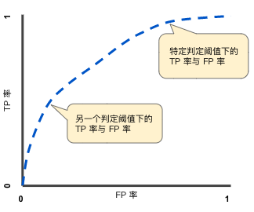

**图2. 不同分类阈值下的TPR和FPR**

为了计算ROC曲线上的点，我们可以使用不同的分类阈值多次评估逻辑回归模型，但这样做的效率很低。

我们可以使用一种基于排序的高效算法来提供此类的信息，这种算法称：**曲线下面积**。

### 10.5.2. 曲线下面积(Area Under the Curve of ROC)

**ROC曲线下面积(AUC)**即图中灰色二维面积，可使用积分计算。

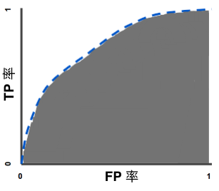

**图3. ROC曲线下面积**

曲线下面积对所有可能的分类阈值的效果进行综合衡量。曲线下面积的一种解读方式可以看做模型将某个随机正类别样本排列在某个随机负类别样本之上的概率。

以下面的样本为例，逻辑回归预测值从左到右升序排列：

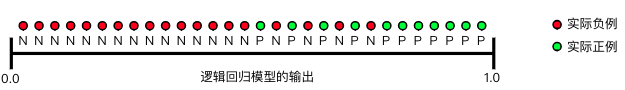

**图4. 预测按逻辑回归分数从左到右升序排列**

曲线下面积表示随机正类别(绿色)样本位于随机负类别(红色)样本右侧的概率。若随机抽取一个正样本和一个负样本，分类器**正确判断**正样本的值高于负样本之**机率** =AUC

曲线下面积的取值范围是0-1。 预测结果100%错误的模型曲线下面积为0.0；而100%正确的模型曲线下面积为1.0。AUC值越大，模型正确率越高。AUC值在0.5-1.0之间的模型，是有意义的；AUC=0.5的模型是没有意义的。AUC=1则表明模型是一个完美分类器，我们往往应该对此存疑(在实践中通常不存在)。

曲线下面积有以下两个原因而比较实用：

- 曲线下面积的**尺度不变**，它衡量的是预测的排名情况，而不是测量其绝对值，
- 曲线下面积的**分类阈值不变**，它衡量的是模型预测的质量，而不考虑所选的分类阈值。

这两个原因都有它的局限性，

- **并非总是希望尺度不变**。有时我们需要良好校准的概率输出。
- **并非总是希望分类阈值不变**。当假负例和假正例的代价存在较大差异时，尽量减少一种类型的分类错误可能至关重要。比如垃圾邮件分类，我们希望优先减少假正例。

## 10.6. 预测偏差(Prediction-bias)

逻辑回归预测应当无偏差。即：

> **预测平均值**应当约等于**观察平均值**

**预测偏差**指的是这两个平均值之间的差值。即：

预测偏差=预测平均值-数据集中相应标签的平均值

> ⚠️注意：**预测偏差**不是**wx+b**中的**b**

如果出现非常高的**非零预测偏差**，说明我们的模型某处存在错误，表明模型对正类别标签的出现频率预测有误。

> 例如我们假设所有的电子邮件中，有1%的邮件是垃圾邮件，而一个出色的模型应该可以预测到电子邮件平均有1%的可能性是垃圾邮件。假如模型给出的可能性是20%，则表明模型出现了预测偏差。

造成预测偏差的可能原因包括：

- 特征集不完整
- 数据集混乱
- 模型实现流水线中有错误？
- 训练样本有偏差
- 正则化过强

假如模型出现了预测偏差，我们可以后期添加校准层来降低偏差。但此非良策。理由如下：

- 治标不治本
- 系统变得更加脆弱，模型更新使得校准层必须持续更新

如果可以的话，我们应当尽量避免添加校准层。

> ⚠️注意：出色的模型偏差通常接近于零。但是，预测偏差低并不能证明模型出色，较差的模型的预测偏差也可能为零。

### 10.6.1. 分桶偏差和预测偏差

逻辑回归可以预测0-1之间的值。不过，所有带标签的样本都正好是0或者1。因此在检查偏差时，我们不能仅根据一个样本就准确地确定偏差，我们必须要在「一大桶」样本中检查预测偏差。(也就是说把足够的样本组合在一起以便能够比较预测值和观察值，逻辑回归的预测偏差才有意义。）

我们可以通过以下的方式构建桶：

- 以线性方式分解目标预测
- 构建分位数

下面是某个特定模型的校准曲线。每个点表示1000个值的分桶。

- x轴表示模型针对该桶预测的平均值

- y轴表示该桶数据集的实际平均值

- > 两个轴均采用对数尺度

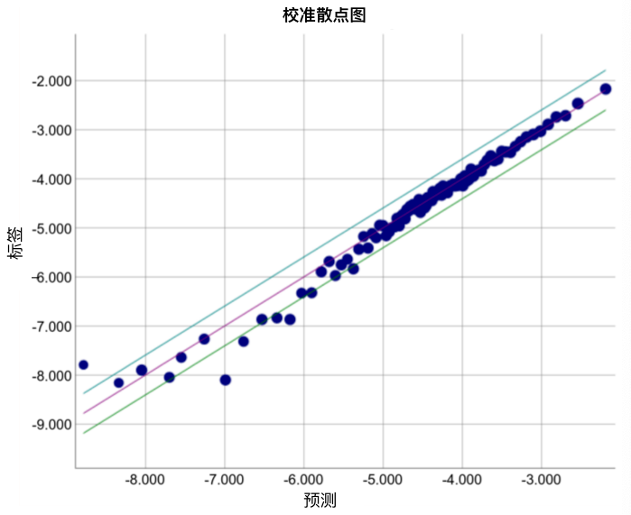

**图5. 预测偏差曲线(对数尺度)**

我们发现对于左侧部分，模型做出的预测很差，以下是造成这样情况的几种可能：

- 训练集不能充分表示数据空间的某些子集
- 数据集的某些子集比其他子集更混乱
- 模型过于正则化(尝试减小Lambda的值)

编程参见[classification.ipynb](../code/classification.ipynb)


<div style="page-break-after: always;"></div>
> 学习目标：
>
> - 了解如何使信息缺乏的系数值正好为 0，以便节省 RAM
> - 了解 L2 正则化之外的其他类型的正则化

# 第11节 稀疏性正则化(L1正则化) 

稀疏矢量往往包含了许多维度，创建特征组合会导致包含更多的维度，这样可能会造成模型十分庞大，且需要大量的RAM。

在高维度稀疏矢量中，最好尽可能使权重降到0，因为权重0连接的特征会从模型中移除。特征设置为0可以节省RAM空间，而且可以减少模型中的噪点。

> **例子：**以一个涵盖全球地区（不仅仅只是涵盖加利福尼亚州）的住房数据集为例。如果按分（每度为 60 分）对全球纬度进行分桶，则在一次稀疏编码过程中会产生大约 1 万个维度；如果按分对全球经度进行分桶，则在一次稀疏编码过程中会产生大约 2 万个维度。这两种特征的特征组合会产生大约 2 亿个维度。这 2 亿个维度中的很多维度代表非常有限的居住区域（例如海洋里），很难使用这些数据进行有效泛化。 若为这些不需要的维度支付 RAM 存储费用就太不明智了。 因此，最好是使无意义维度的权重正好降至 0，这样我们就可以避免在推理时支付这些模型系数的存储费用。


我们可以添加适当的正则化项，将这种想法变成在训练期间解决的优化问题。

- $L_2$正则化可以使权重变小，但是不能使它们恰好为0.0
- 我们设想创建一个正则化项，减少模型中非零系数值的计数。只有在模型能够与数据拟合时增加此计数才有意义。虽然这种计数方法看起来很有吸引力，但是它会把我们的凸优化问题变为非凸优化问题(NP-hard)。所有，$L_0$正则化在实践中并不是一种有效的方法。
- $L_1$正则化作用类似于$L_0$，但是它具有凸优化的优势，可以有效的进行计算。因此，我们可以使用$L_1$正则化使模型中很多信息缺乏的系数正好为0，从而在推理时节省RAM。

## 11.1. $L_1$和$L_2$正则化

L2 和 L1 采用不同的方式降低权重：

- L2会降低(权重^2)
- L1会降低(|权重|)

因此，两者具有不同的导数:

- L2的导数为(2 * 权重)
- L1的导数为(k)，这是一个与权重无关的常数

我们可以将 L2 的导数的作用理解为每次移除权重的 x%。对于任意数字，即使按每次减去 x% 的幅度执行数十亿次减法计算，最后得出的值也绝不会正好为 0(除非浮点精度限制)。L2 通常不会使权重变为 0。

我们可以将 L1 的导数的作用理解为每次从权重中减去一个常数。不过，由于减去的是绝对值，L1在 0 处具有不连续性，这会导致与 0 相交的减法结果变为 0。例如，如果减法使权重从 +0.1 变为 -0.2，L1 便会将权重设为 0。

>  L1正则化，减少所有权重的绝对值，证明对宽度模型十分有效。这条说明对一维模型有效。

编程参见[l1_regularization.ipynb](../code/l1_regularization.ipynb)


<div style="page-break-after: always;"></div>
> 学习目标：
>
> - 对神经网络有一定的了解

# 第12节 神经网络简介

## 12.1. 介绍

我们可以发现下面的分类问题属于非线性问题：

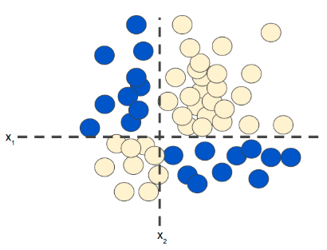

**图1. 非线性分类问题**

非线性意味着我们不能使用如下形式的模型$b+w_1x_1+w_2x_2$来准确预测标签。也就是说，「决策面」不是直线。我们需要添加特征组合，如$x_1x_2$这样的特征。

但假如我们遇到更复杂的非线性分类问题呢？如下：

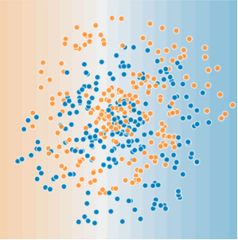

**图2.更难的非线性问题**，无法用线性模型解决

神经网络如何帮助解决非线性问题，我们先来看一个线性模型：


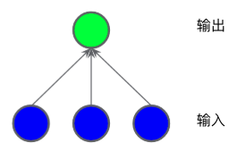

**图3. 线性模型**

上面的图表展示的模型是线性模型，我们为其添加隐藏层。


**图4.三层模型**

此模型尽管添加两层隐藏层，但其依旧是线性模型，不能解决上述非线性问题。

## 12.2. 激活函数

要对非线性问题进行建模，我们可以直接引入非线性函数，如**图5**所示:

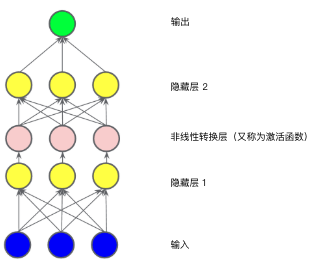

**图5. 包含激活函数的三层模型**，非线性转换层通常不绘制

在隐藏层1的各个节点的值传到下一层进行加权求和之前，先通过一个非线性函数进行转换，这种非线性函数称为**激活函数**。

### 12.2.1. 常见激活函数

- **Sigmoid(S型函数)**

  > 把加权求和转换为介于0~1之间的值

  $$F(x) = \frac{1}{1+e^{-x}}$$


  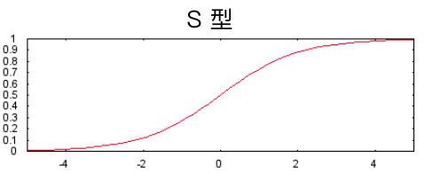

  **图6. Sigmoid激活函数**

- **ReLU(修正线性单元)**

  > 效果通常好于Sigmoid函数，易于计算

  $$F(x)=max(0,x)$$


  

  **图7.ReLu激活函数**

- **tanh(双曲正切)**

  > 以0为中心，输入输出在(-1, 1)之间

  $$tanh(x)=\frac{sinh(x)}{cosh(x)}=\frac{e^x-e^{-x}}{e^x+e^{-x}}$$

  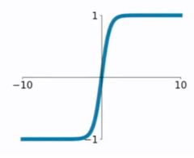

  **图8.tanh激活函数**

实际上，所有的数学函数都可以作为激活函数。

## 12.3. 初始化

神经网络初始化十分重要.

## 12.4. 特征工程

即使是神经网络，有时候我们也需要特征工程，比如拟合螺旋曲线时，我们可以组合特征。

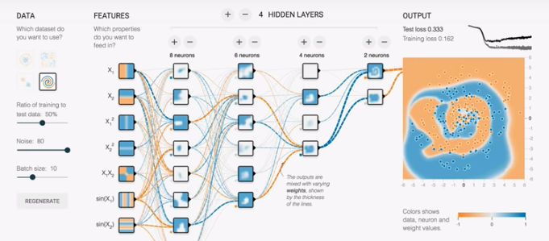

## 12.5. 小结

> 神经网络的标准组件有如下：

- 一组**节点**，类似于神经元，位于层中
- 一组**权重**，表示每个神经网络层与下一层之间的关系。
- 一组**偏差**，每个节点一个偏差
- **激活函数**，对层中每个节点的输出进行转换。不同的层可能拥有不同的激活函数

编程参见：[intro_to_neural_networks.ipynb](../code/intro_to_neural_networks.ipynb)


<div style="page-break-after: always;"></div>
学习目标：

- 了解反向传播算法

# 第13节 训练神经网络

**反向传播算法(Back propagation)**是最常见的一种神经网络训练算法，一个直观的可视化的例子：[反向传播直观解释](https://google-developers.appspot.com/machine-learning/crash-course/backprop-scroll/)

## 13.1. 失败案例(Failure Cases)

下面展示了几种常见的BP出错的情况

- **梯度消失**

  靠近输入层(较低层)的梯度可能会变得非常小。在深度网络中，计算这些梯度时，可能会涉及许多小项的乘积。

  当较低层的梯度逐渐消失到0时，这些层的训练速度会非常缓慢，甚至停止训练。

  **ReLU激活函数有助于防止梯度消失。**

- **梯度爆炸**

  如果网络中的权重过大，则在较低层的梯度会涉及许多大项的乘积。在这种情况下，梯度就会爆炸：梯度过大会导致模型难以收敛。

  **批标准化(Batch-Nomalization)可以降低学习速率，有助于防止梯度爆炸。**

- **ReLU单元消失**

  一旦ReLU单元的加权和低于0，ReLU单元就可能会停滞。它会输出对网络没有任何贡献的0激活，而梯度在反向传播算法期间将无法再从中流过。梯度的来源被切断，ReLU的输入可能无法作出足够的改变来使加权和恢复到0以上。

  **降低学习速率有助于防止ReLU单元消失**。
## 13.2. Dropout正则化

**丢弃(Dropout)**是另一种形式的正则化，可用于神经网络。工作原理是，在梯度下降法的**每一步**中随机丢弃一些网络单元。丢弃得越多，正则化效果越强：

- **0.0:** 无丢弃正则化
- **1.0**: 丢弃所有内容，模型学不到任何内容
- **0.0~1.0**之间的值更有用

## 13.3. 最佳实践(Best Practices)

- ReLU
- Batch-Normalization
- Small Learning Rate
- Dropout

编程参见[improving_nn_performance.ipynb](../code/improving_nn_performance.ipynb)


<div style="page-break-after: always;"></div>
> 学习目标：
>
> - 理解多类别分类问题，尤其是 Softmax
> - 在 TensorFlow 中制定 Softmax 解决方案

# 第14节 多类别神经网络

## 14.1. 一对多

**一对多**提供了一种利用二元分类的方法。一个分类问题假如给定了N个可预测的标签，我们就可以训练N个二元分类器，使得每个分类器都可以回答特定的问题。

如以下例子，我们将一张小狗的照片作为正样本，那么对其它4个分类器来说，它就是负样本：

| 标签？ | 0/1 (表示「不是」和「是」) |
| ------ | -------------------------- |
| 苹果   | 0                          |
| 熊     | 0                          |
| 糖果   | 0                          |
| 小狗   | 1                          |
| 鸡蛋   | 0                          |

**注意**：在类别总数较少的时候，这种方法比较合理，随着类别数量增加，其效率会变得越来越低下。

我们可以借助深度神经网络来创建更加高效的一对多模型。

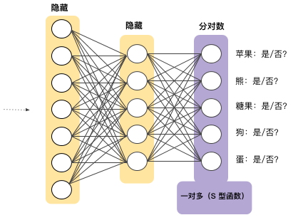

**图1. 一对多神经网络**，每个输出节点对应一个不同的类别


## 14.2. Softmax

我们知道，逻辑回归可以生成介于0.0~1.0之间的小数。

Softmax想把这一想法延伸到多类别领域。也就是说，Softmax会为每个类别分配一个用小数表示的概率，这些概率求和的结果必须为1.0，**这种附加的限制会有助于让训练过程更快收敛**。

如： Softmax可能会得出图片属于某一特定类别的概率

| 标签？ | 概率  |
| ------ | ----- |
| 苹果   | 0.001 |
| 熊     | 0.04  |
| 糖果   | 0.008 |
| 小狗   | 0.95  |
| 鸡蛋   | 0.001 |

**Softmax层**是紧挨着**输出层之前**的神经网络层。Softmax层和输出层拥有一样的节点数。如图2所示:

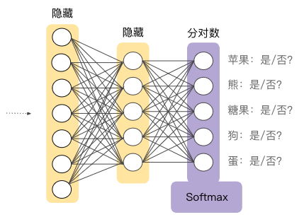

**图2. 神经网络中的Softmax层**


Softmax公式如下：

$$p(y=j|x)=\frac{e^{w_j^Tx+b_j}}{\sum_{k\in K}e^{w_k^Tx+b_k}}$$

> **注意**：公示的本质其实是把逻辑回归公式延伸到了多类别


## 14.3. Softmax选项

- **完整Softmax**，即我们前面讨论的Softmax，也就是说对每个可能的类别计算概率。

- **候选采样**，指Softmax针对**所有**的正类别标签计算概率，但仅针对负类别标签的**随机样本**计算概率。

  > 例如，如果我们想要确定某个输入图片是小猎犬还是寻血猎犬图片，则不必针对每个非狗狗样本提供概率。

### 14.3.1. 为什么采用候选采样？

之所以采用候选采样的方法，在于当类别数量较少时，完整的Softmax代价很小，但随着类别数量增多，代价会变得高昂。**候选采样**可以提高处理大量类别的问题的效率。(提高效率)


## 14.4. 一个标签与多个标签

Softmax假设每个样本只能属于一个类别。但是，一些样本可以同时被分类为多个类别，对于这种情况：

- 我们不能使用Softmax
- 模型必须依赖多个逻辑回归

例如：

> 假设我们的样本是只包含一项内容（一块水果）的图片。Softmax 可以确定该内容是梨、橙子、苹果等的概率。
>
> 但如果我们的样本是包含各种各样内容（几碗不同种类的水果）的图片，我们必须改用多个逻辑回归。


编程参见[mnist.ipynb](../code/mnist.ipynb)


<div style="page-break-after: always;"></div>
> 学习目标：
>
> - 学习嵌入的定义和用途
> - 学习嵌入如何编码语义关系
> - 学习如何使用嵌入
> - 学习如何训练有意义的嵌入

# 第15节 嵌入(Embedding)

- 什么是嵌入？

  **嵌入**是一种相对低维的空间，您可以将高维矢量映射到这种低维空间里


- 为什么使用嵌入？

  通过使用嵌入，可以让在大型输入（比如代表字词的稀疏矢量）上进行机器学习变得更加容易。在理想情况下，嵌入可以将语义上相似的不同输入映射到嵌入空间里的邻近处，以此来捕获输入的语义。一个模型学习到的嵌入，也可以被其他模型重用。

## 15.1. 协同过滤(Collaborative Filtering)

**协同过滤**是一项可以预测用户兴趣(根据很多其他用户的兴趣)的任务。

> 比如我们要为用户推荐影片，我们已有的信息是用户及其观看过的影片列表。

学习**嵌入**之前需要我们学习如何去**表示训练数据**。


### 15.1.1. 在一维数轴上排列影片

| 影片                                                         | [分级](https://wikipedia.org/wiki/Motion_Picture_Association_of_America_film_rating_system#MPAA_film_ratings) | 说明                                                         |
| ------------------------------------------------------------ | ------------------------------------------------------------ | ------------------------------------------------------------ |
| [《蓝》](http://www.imdb.com/title/tt0108394/)               | R                                                            | 一位法国妇人在丈夫与爱女丧命于一场车祸后悲痛欲绝。           |
| [《蝙蝠侠：黑暗骑士崛起》](http://www.imdb.com/title/tt1345836) | PG-13                                                        | 这部影片是[《黑暗骑士》](http://www.imdb.com/title/tt0468569/)的续集，以 DC 漫画的宇宙空间为背景，讲述蝙蝠侠尽力保护高谭市免遭核毁灭的故事。 |
| [《哈利·波特与魔法石》](http://www.imdb.com/title/tt0241527/) | PG                                                           | 一个失去双亲的男孩发现自己会巫术，于是前去霍格沃茨魔法学校学习魔法，在这里他与邪恶的伏地魔展开了第一场激斗。 |
| [《超人总动员》](http://www.imdb.com/title/tt0317705/)       | PG                                                           | 被迫在郊区过着平民生活的超人一家重出江湖，拯救超人家族免遭辛拉登及其杀手机器人的迫害。 |
| [《怪物史莱克》](http://www.imdb.com/title/tt0126029/)       | PG                                                           | 可爱的怪物史莱克和他的伙伴驴子，启程营救被火龙囚禁在城堡的菲奥娜公主。 |
| [《星球大战》](http://www.imdb.com/title/tt0076759)          | PG                                                           | 卢克·天行者和汉·索洛与两个义军机器人结成一队，共同拯救莱娅公主并保卫星球。 |
| [《疯狂约会美丽都》](http://www.imdb.com/title/tt0286244)    | PG-13                                                        | 专业骑行者查宾在环法自行车大赛期间被挟持，他的奶奶带着他家的胖狗漂洋过海，并在爵士歌手三姐妹的帮助下救出了他。 |
| [《记忆碎片》](http://www.imdb.com/title/tt0209144/)         | R                                                            | 一位短期记忆丧失症患者将线索纹在身上，竭尽全力寻找杀害自己妻子的凶手。 |

- **一个可行(但不完善)的解决方案**


**图1. 一种可行的一维排列**，这种排列更多的捕捉了电影的分级(适合儿童还是成人)，但实际中还需要考虑影片的许多特征。


### 15.1.2. 在二维空间排列影片


**图2.一种可行的二维排列**

在二维平面上，定义影片之间的距离，采取了「适合观影人群」和「影片类型」(商业片还是艺术片)两种重要特征，让两种特征更相似的影片位于更近的位置。

更笼统的说，我们所做的是把这些影片映射到了**嵌入空间**，其中每一个字词都由一组二维坐标来表示。通常情况下，学习d维嵌入时，每部影片都由d个实值数字表示，一个数字表示在一个维度中的坐标。

> 在学习嵌入时，每个维度的学习跟它们的名字无关。有时我们可以查看嵌入并为维度赋予语义，但有时则无法做到。通常，每个**此类维度**都称为一个**潜在维度**，因为它代表的特征没有明确显示在数据中，而是要根据数据推断得出。
>
> 最终，**真正有意义的是**嵌入空间中各个影片之间的**距离**，而不是单个影片在任意指定维度上的坐标。


### 15.1.3. 分类输入数据(Categorical Input Data)

**分类数据**是指用于表示一组有限选项中的一个或多个离散项的输入特征。

> 例如，它可以是某用户观看过的一组影片，某文档中使用的一系列单词，或某人从事的职业。

分类数据的最高效表示方式是使用**稀疏张量**含有极少非零元素的张量。

> 例如，我们可以为每部可能的影片分别分配一个唯一的ID，然后通过用户已观看影片的稀疏张量来表示每位用户。

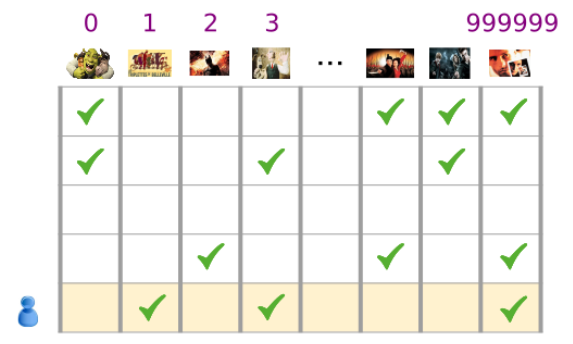

**图3. 影片推荐问题的数据**

在图3中，每一行都代表一个用户的影片观看记录样本。如最后一行就对应于稀疏张量[1, 3, 999999]。

同样，我们可以把字词、句子和文档表示为稀疏张量，这种情况下，词汇表的每个字词所扮演的角色就类似于上面示例中的影片。

为了在机器学习系统中使用这类表示法，我们需要把每个稀疏矢量表示为数字矢量，**使得语义上相似的项在矢量空间中具有相似的距离**。

### 15.1.4. 如何将字词表示为数字矢量？

- **独热编码(one-hot encoding)**：最简单的做法，定义一个巨型输入层，为**词汇表中的每个字词**设定一个节点，或者至少为我们数据中**出现的每个字词**设定一个节点。

  > 例如，我们有50万个单词，那么我们就使用长度为50万的矢量来表示每个单词，单词根据索引把矢量对应位置设为1，其它位置为0。

- **词袋编码(bag of words)**: 更常见的做法，是使用一个包含各个单词在大块文本中出现的次数的向量。

  > 在一个词袋矢量中，50万个节点中会有多个节点具有非零值。

无论怎样确定非零值，如果把节点和字词一一对应，我们得到的输入矢量就会比较稀疏，即：矢量很大，但非零值相对较少。

### 15.1.5. 稀疏表示法存在以下问题：

- 网络的规模
巨型输入矢量意味着神经网络的对应权重数目会极其庞大。会进一步引发以下问题:
1. **数据量**：模型权重越多，高效训练需要的数据就越多。	
  
2. **计算量**：权重越多，训练和使用模型需要的计算能力要求就越高。

- 矢量之间缺乏有意义的联系

> 如果您已将 RGB 通道的像素值馈入到图片分类器中，分析“邻近”值便行得通。不管是从语义上来看，还是从矢量之间的几何距离来看，红蓝色与纯蓝色都是邻近的。不过，对于在索引 1247 处设为 1 以表示“马”的矢量而言，如果说它与在索引 238 处设为 1 以表示“电视机”的矢量不够邻近，那么它与在索引 50430 处设为 1 以表示“羚羊”的矢量亦然。


### 15.1.6. 解决方案：嵌入

我们可以通过**嵌入**来解决上述问题，也就是把==大型稀疏矢量映射到一个保留语义关系的低维空间==。

## 15.2. 转换到低纬度空间(Translating to The Lower Dimensional Space)

要解决稀疏输入数据的核心问题，我们可以把高维数据映射到低维空间。

通过这样的嵌入，我们把语义上相似的项归到一起，并把相异项分开。矢量空间中的位置(距离和方向)可以对良好嵌入的语义进行编码。如下图所示:

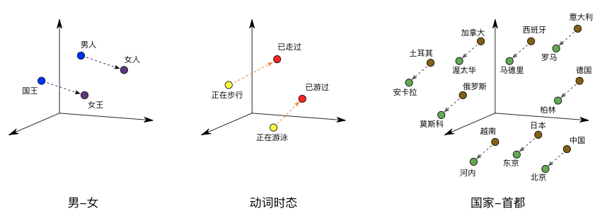

**图4. 嵌入可视化**

借助这样有意义的空间，机器学习系统能够检测出对学习任务可能有帮助的模式。

### 15.2.1. 收缩网络

我们需要在「足够的维度编码丰富的语义」和「足够小的嵌入空间快速训练」中很好的权衡，通常几百个维度的嵌入比较实用，而比起NLP(自然语言处理)任务中使用的词汇规模小好几个数量级。

### 15.2.2. 嵌入充当查询表

嵌入是一个矩阵，每列表示我们词汇中的一项对应的矢量。要获得某个词汇项的密集矢量，我们可以检索该项所对应的列。

要转换多个词汇的稀疏矢量为密集矢量，我们可以检索各项的嵌入，然后相加。如果词汇包含计数，则先相乘再相加求和。

### 嵌入查询充当矩阵乘法

> 我们刚刚阐述的查询、乘法和加法程序等效于矩阵乘法。假设有一个 1 X N 的稀疏表示 S 和一个 N X M 的嵌入表 E，矩阵乘法 S X E 可以得出密集矢量 1 X M。

这里的问题，==**是获得嵌入表E**==。


## 15.3. 获得嵌入(Obtaining Embeddings)

我们可以通过多种方式来获取嵌入，==**包括Google研发的世界一流算法**==


### 15.3.1. 标准降维技术(Standard Dimensionality Reduction Techniques)

现在已有许多数学手段可以在低维空间捕获高维空间的重要结构，理论上，这些技术都可以用作机器学习系统中来构建嵌入。

> 例如，[主成分分析](https://wikipedia.org/wiki/Principal_component_analysis) (PCA) 已用于创建字词嵌入。在给定一组实例的情况下，例如字词矢量包，PCA 会尝试查找高度相关且可以合并的维度。

### 15.3.2. Word2Vec

> Word2vec 是 Google 为了训练字词嵌入而研发的一种算法。Word2vec 基于**分布假设**，将语义上相似的字词映射到在几何图形上邻近的嵌入矢量。
>
> 分布假设指出经常具有相同相邻字词的字词往往在语义上相似。如：「狗」和「猫」这两个字词经常靠近「兽医」一词出现，这就可以说明这两个字词在语义上相似。
>
> Word2Vec 通过训练神经网络来区分实际共同出现的多组字词与随机出现在一起的字词，从而充分利用此类上下文信息。输入层采用一种稀疏表示法用于组合一个目标字词与一个或多个上下文字词。这一输入层会连接到一个较小的隐藏层。
>
> - 在其中一版算法中，系统通过用随机噪点字词替代目标字词来举出反面示例。在给出正面示例“the plane flies”的情况下，系统可能会换成“jogging”来创建对比鲜明的反面示例“the jogging flies”。
>
> - 另一版算法通过将真实的目标字词与随机选择的上下文字词配对来创建反面示例。因此，系统可能会举出正面示例（(the, plane)、(flies, plane)）和反面示例（(compiled, plane)、(who, plane)），然后通过学习分辨哪几对真正地在文字中一起出现。
>
> 不过，分类器不是上述任何一版算法的真正用途。在训练模型后，你得到的是一组嵌入。借助将输入层连接到隐藏层的权重，您可以将字词的稀疏表示映射到小型矢量。这类嵌入可在其他分类器中重复利用。
>
> 要详细了解 word2vec，请参阅 [tensorflow.org 上的教程](https://www.tensorflow.org/tutorials/word2vec/index.html)


### 15.3.3. 将嵌入训练为大型模型的一部分

我们可以把嵌入作为神经网络的一部分进行学习。通过这样的方法，我们可以为自己的铜锭系统量身定制嵌入，不过耗费的时间可能比单独训练嵌入的时间更长。

一般来说，我们具有稀疏数据时，我们可以创建一个**嵌入单元**，这个嵌入单元其实是大小为d的一个**特殊类型的隐藏单元**。此嵌入层可以和其他任何特征和隐藏层组合。和其它任何DNN中一样，最终层是要**优化的损失函数**。

> 例如，假设我们正在执行协同过滤，目标是根据其他用户的兴趣预测某位用户的兴趣。我们可以把这个问题进行监督式学习问题进行建模，具体做法是随机选取用户观看过的一部分影片作为正类别标签，然后再优化损失。架构如图5所示：

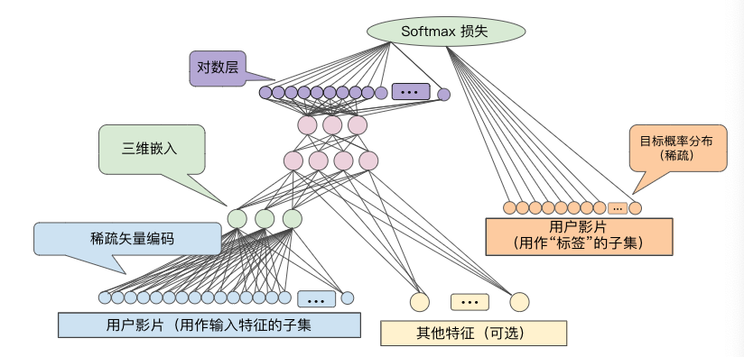

**图5. 根据协同过滤数据学习影片嵌入的DNN架构示例**

再举一个例子，如果我们想在DNN中针对房地产广告词创建嵌入层来预测房价，我们可以把训练数据中的已知房屋售价作为标签来优化L2损失。

在学习d维嵌入时，每一项都会映射到d维空间的一个点，这样相似项就会在该空间内彼此邻近。

图6说明了在嵌入层中学到的权重与几何视图之间的关系。输入节点与d维嵌入层中的节点之间的边的权重对应于d维坐标轴中每一维的坐标值。

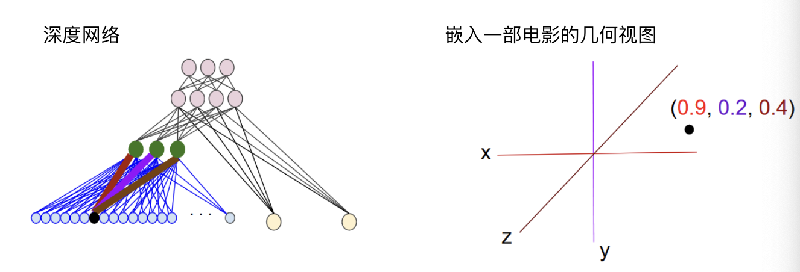

**图6.嵌入层权重的几何视图**


<div style="page-break-after: always;"></div>
> 学习目标：
>
> - 了解生产环境机器学习系统中的组件
> - 了解动态与静态训练
> - 了解动态与静态推理
> - 了解生产环境机器学习系统中的数据依赖问题

# 第16节 机器学习工程(Machine Learning Engineering)

## 16.1. 生产环境下的机器学习系统(Production ML System)

> 除了机器学习算法以外，机器学习还包括许多其他内容。生产环境机器学习系统包含了大量组件。

当然，如何构建模型来预测从未见过的新数据是任何机器学习系统的核心部分。但对于机器学习整个生态系统来说，它不过是其中一个执行机器学习任务的小黑盒子，整个系统还包括很多与训练无关的组件。

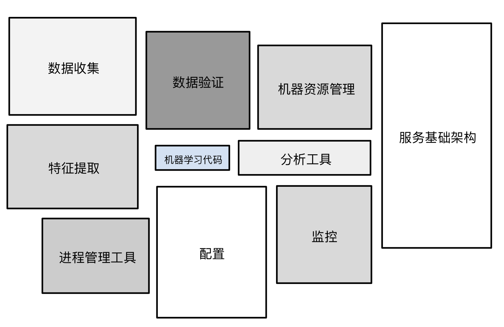

**图1.机器学习系统的生态**

例如，我们通常还需要做以下的事情：

- 数据收集
- 特征提取
- 数据验证
- 各种形式的监控
- 数据分析

我们需要把这些信息整合起来，以便做出对现实世界有用的预测，这就涉及到了很多不同的组件了。

幸运的是，在实际操作中，我们不必自己构建这些组件，有大量现成的组件供我们在特定的场景中使用。(考虑是否值得造轮子)

下面我们将给出一些选择组件的参考。


## 16.2. 静态训练与动态训练(Static vs. Dynamic Training)

从广义上来讲，训练模型的方式有两种：

- **静态模型**采用离线训练方式。也就是说，我们只训练模型一次，然后使用训练后的模型。
- **动态模型**采用在线训练方式。也就是说，数据会不断进入系统，我们通过不断地更新系统将这些数据整合到模型中。

这两种方式各有利弊，

**静态模型 - 离线训练**

- **优点**：易于构建和测试 - 使用批量训练和测试，对其进行迭代，直到达到良好效果。

- **缺点**： 仍然需要对输入进行监控 - 如果输入的分布发生了变化，而我们的模型尚未适应这种变化，最终可能就会出现异常的预测结果。
- **缺点**： 模型容易过时。

**动态模型 - 在线训练**

- 随着时间推移不断为训练数据注入新数据，定期同步更新版本。

- 使用渐进式验证，而不是批量训练和测试

- **缺点**：更复杂的系统，包括更强的监控、模型回滚和数据隔离功能

- **优点**：会根据变化作出相应调整，避免了过时问题

- > 在线训练的模型可能更适合 随时间推移常有趋势和季节性变化的情况， 我们会希望确保模型尽可能反映出最新变化。


## 16.3. 静态推理与动态推理(Static vs. Dynamic Inference)

我们可以使用任一推理策略：

- **静态 - 离线推理**，指的是使用 MapReduce 或类似方法批量进行所有可能的预测。然后，将预测记录到 SSTable 或 Bigtable 中，并将它们提供给一个缓存/查询表。
- **动态 - 在线推理**，指的是使用服务器根据需要进行预测。

这两种策略也各有利弊：

**静态 - 离线推理**

- 使用 MapReduce 或类似方法批量进行所有可能的预测。
- 记录到表格中，然后提供给缓存/查询表。
- **优点**：不需要过多担心推理成本。
- **优点**：可以使用批量方法。
- **优点**：可以在推送之前对数据预测执行后期验证。
- **缺点**：只能对我们知晓的数据进行预测，不适用于存在长尾或极端的情况。
- **缺点**：更新可能延迟数小时或数天。

**动态 - 在线推理**

- 使用服务器根据需要进行预测。
- **优点**：可在新项目加入时对其进行预测，非常适合存在长尾的情况。
- **缺点**：计算量非常大，对延迟较为敏感，可能会限制模型的复杂度。
- **缺点**：监控需求更多，不仅要监测数据工作本身，还要监控预测的输出分布，确保不会发生故障。


## 16.4. 数据依赖关系(Data Dependencies)

> **数据之于机器学习开发者的重要性等同于代码之于传统编程人员的重要性。**

回忆一下，我们在编写软件代码时，我们都希望尽量减少对外部的依赖关系。在创建机器学习模型时也是如此，我们希望包含尽可能少的数据依赖关系，我们这里说的**数据依赖关系就是指用于训练和预测的输入特征**。

### 16.4.1. 特征管理

- 输入数据（特征）决定机器学习系统的行为。

  > 输入特征发生变化，系统行为也会随之变化。

- - 我们可以针对软件库编写单元测试，但数据呢？

- 选择输入信号时要谨慎。

- - 甚至比决定要依赖哪个软件库时更谨慎吗？

### 16.4.2. 针对输入数据的问题

数据没有与代码单元测试相媲美的测试，但是我们可以列一份检查清单：

- 可靠性

  - 数据可靠吗？
  - 这些我要用到的数据是否始终会在我需要的时候以同样的方式生成？

- 版本控制

  - 特征是否会随着时间推移发生变化？
  - 我们是否要考虑可特征的各种版本，使用一个布尔指示器？

- 必要性

  - 信号的实用性是否能证明值得添加此信号？

  - 添加新特征便会增加系统的长期维护成本，因此添加新特征所获得的效果与付出的代价相比，是否划算？

- 相关性

  - 特征确实是我们认为存在因果关系的特征，还是只是碰巧具有相关性？
  - 此类特征如果发生变化我们是否会知晓？
  - 可以向系统注入随机性的方式梳理这样的相关性，**这是一种很重要的策略**。

- 反馈环

  - 哪个输入信号可能会受到我的模型输出的影响？

  - 我们使用一个例子来解释:

    > 我们有两个来自不同公司的股票市场预测模型，如果一个预测模型存在错误，则可能导致某只股票价格上涨。
    >
    > 而另一家公司也在关注这方面，并学习了这些数据，其行为也可能会发生变化。
    >
    > 因此，系统A中的错误事实上可能会改变系统B产生错误的行为，即使这两个系统确实来自不同的公司，完全没有共同元素。
    >
    > 由此看，反馈环是确实存在的，我们要想方设法跟踪并考虑它们。

  - 更多例子：

    - 大学排名模型 - 将选择率（即申请某所学校并被录取的学生所占百分比）作为一项学校评分依据。

      > 此模型的排名可能会提高学生对高评分学校的兴趣，从而使这些学校收到的申请增加。如果这些学校录取的学生人数继续保持不变，则选择率会增大（录取的学生所占百分比会下降）。这样会提升这些学校的排名，从而进一步提高未来有意申请这些学校的学生的兴趣，如此循环下去…

    - 图书推荐模型 - 根据小说的受欢迎程度（即图书的购买量）向用户推荐其可能喜欢的小说。

      > 图书推荐有可能吸引用户购买，而且这些额外销量将作为输入项反馈回模型，从而使该模型更有可能在将来推荐同样的图书。

    - 交通状况预测模型 - 使用海滩上的人群规模作为特征之一预测海滩附近各个高速公路出口的拥堵情况。

      > 有些准备前往海滩的游客可能会根据交通状况预测结果来制定出行计划。如果海滩上人群规模很大且交通预计会拥堵，则许多人可能会另做打算。这样一来，海滩上游客的数量就会减少，进而使模型作出交通畅通的预测，然后这又会导致前往海滩的游客增加，这样，这个循环就会反复下去。


<div style="page-break-after: always;"></div>
> 学习目标：
>
> - 确定应用于现实世界的机器学习模型中的缺陷

# 第17节 机器学习系统在现实世界里的应用(ML Systems in the Real World)

## 17.1. 癌症预测

### 17.1.1. 背景


- 模型经过训练后可以根据病历来预测“病人患有癌症的概率”
- 特征包括病人年龄、性别、之前的病史、医院名称、生命体征、检验结果
- 模型在处理预留检验数据方面表现出色
- 但模型在针对新病人进行预测时表现却很糟糕，这是为什么呢？

> 我们可以发现，模型中包含了一个特征是「医院名称」，而有的医院名称类似于「贝斯以色列癌症中心」，其实这样的特征可以更清楚地表明患者是否患有癌症(医院名称中包含「癌症」这样的字眼)，即使这样的特征被转换成了数值特征，也会给模型带来微妙的欺骗性，我们称这样的情况为**标签泄露**，在实际应用中我们务必避免。


## 17.2. 18世纪文学

### 17.2.1 背景


- 18 世纪文学教授想仅仅根据作者使用的“思想隐喻”来预测作者的政治派别。
- 研究小组建立了一个大型的有标签数据集（其中逐句纳入了许多作者的作品），并将其拆分成了训练集/验证集/测试集。
- 训练后的模型在根据测试数据进行预测时的表现几近完美，但研究人员却怀疑结果的准确性。可能出了什么问题？

我们考虑，数据拆分方式出现了问题？

- 数据拆分方式 A：研究人员将每位作者的一些样本放在训练集中，一些放在验证集中，另一些放在测试集中。

  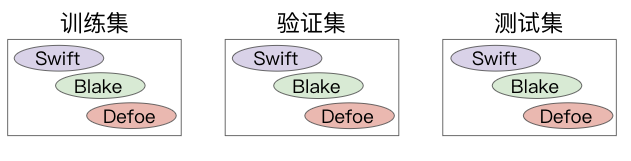

> 以Samuel L. Richardson的句子为例， 他的一些句子会归入训练数据，一些句子会归入验证数据， 还有一些会归入测试数据。这意味着，该模型可以了解Richardson在语言使用方面的特质， 而不仅仅是了解他使用的隐喻手法。

- 数据拆分方式 B：研究人员将每位作者的所有样本都放在单个集中。

  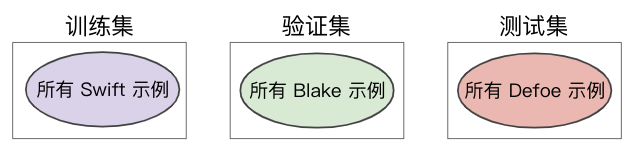

> 在进行这次实验的过程中，我们发现根据测试数据得出较高的准确率要难得多， 而且仅根据隐喻数据来预测政治派别也难得多。

### 17.2.2. 结果

根据数据拆分方式 A 训练的模型比根据数据拆分方式 B 训练的模型的准确率要高得多。

### 17.2.3. 结论

仔细考虑如何拆分样本，需要我们了解数据代表的含义。


## 17.3. 有效的机器学习应用准则(Effective Machine Learning Guidelines)

1. 当我们创建第一个模型的时候，要确保是一个极其简单的模型。

2. **简单的线性模型**是一个很好地开始，方便我们验证管线的正确性。

3. 在对模型质量进行任何迭代之前，我们需要确保端到端的数据管线是完全正确的，因为数据管线中存在的错误很难跟踪排查。

4. 在训练和评估的最初阶段，我们需要使用一个可观察的简单指标，以验证相应模型的行为是否符合我们的预期。

5. 对输入特征进行监控，将模型配置视为代码，做好记录。

6. 记下所有的实验结果，哪怕是失败的结果，这对后续的调试及其重要。


<div style="page-break-after: always;"></div>
# 第18节 后续步骤

要继续机器学习培训，进一步巩固您的 TensorFlow 技能，请查看以下资源：

## 18.1. 机器学习实践课程

查看下列有关 Google 如何在其产品中运用机器学习技术的真实案例研究，以及相关视频和实际动手编码练习：

- [**图片分类**](https://developers.google.com/machine-learning/practica/image-classification/)：了解 Google 如何开发用于在 Google 照片中为搜索提供支持的图片分类模型，然后构建您自己的图片分类器。
- 更多机器学习实践课程即将推出！

## 18.2. 其他机器学习资源

- [深度学习](https://www.udacity.com/course/deep-learning--ud730)：关于神经网络的机器学习高级课程，对图片和文字模型进行了广泛的介绍
- [机器学习规则](https://developers.google.com/machine-learning/rules-of-ml)：关于机器学习工程的最佳做法
- [TensorFlow.js](https://js.tensorflow.org/)：采用 WebGL 加速技术且基于浏览器的 JavaScript 库，用于训练和部署机器学习模型

## 18.3. TensorFlow

- [安装 TensorFlow](https://www.tensorflow.org/install/)：关于在 Mac OS X、Ubuntu 和 Windows 计算机上设置 TensorFlow 的说明
- [tf.contrib.learn 快速入门](https://www.tensorflow.org/get_started/tflearn)：关于使用高级 TensorFlow API 构建神经网络分类器的指南
- [TensorFlow 编程人员指南](https://www.tensorflow.org/programmers_guide/)：有关 TensorFlow 主要功能（包括变量、线程和调试）的详细指南
- [2017 年 TensorFlow 开发者峰会](https://www.youtube.com/playlist?list=PLOU2XLYxmsIKGc_NBoIhTn2Qhraji53cv)：一系列技术讲座和演示，重点介绍 TensorFlow API 和实际应用

## 18.4. 参加 Kaggle 大赛

已准备好开始运用新掌握的机器学习技能来应对数据科学领域面临的现实挑战了吗？ 您可以在 [Kaggle](https://www.kaggle.com/) 上的众多比赛中一试身手！

<button><a href="https://www.kaggle.com/competitions">报名参加Kaggle</a></button>

<button><a href="https://tianchi.aliyun.com/competition/index.htm">报名参加天池</a></button>


